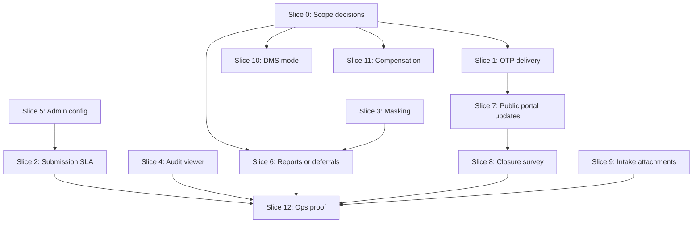

# Business Readiness Plan

Date: 2026-07-02
Companion files:

- Problem list: `docs/BUSINESS_READINESS_AUDIT.md`
- Target solution: `docs/BUSINESS_READINESS_SOLUTION.md`
- Contract source: `docs/CMS_AUTO_SRS.md`

## How To Use This Plan

Use this as the remediation backlog, not as Forge state. Each slice should become
one scoped implementation task with its own proof. Do not start lower-priority
product expansion until the P0 slices are accepted or explicitly deferred.

## Work Order

### Slice 0 - Business Scope Decisions

Purpose: avoid building the wrong product.

Decisions required:

- Is the next acceptance target the complaint MVP or the broader dealership
  accountability product?
- Are report deferrals for RPT-002, RPT-003, RPT-005 through RPT-012, RPT-014,
  RPT-015, and RPT-016 signed?
- Is DMS live/test integration required for UAT, or is manual-DMS pilot scope
  signed?
- Is compensation metadata in MVP scope?
- Which notification channels are approved for customer OTP and survey links?

Exit criteria:

- Signed scope notes exist.
- UAT checklist maps to real routes and proof commands.
- No implementation needed if decisions are signed.

Proof:

- Human signoff.

### Slice 1 - Customer OTP Delivery

Fixes:

- BIZ-P0-01.

Scope:

- Portal OTP generation, hash-only persistence, and customer delivery through
  the existing notification path.
- Arabic and English OTP template.
- Safe failure states in portal tracking UI.

Likely files:

- `apps/api/src/modules/portal/portal.service.ts`
- `apps/api/src/modules/notifications/*`
- `apps/web/src/components/portal-tracking/index.tsx`
- `apps/web/src/i18n/portal-tracking.ts`

Proof:

- `corepack pnpm test:api -- portal.tracking`
- `corepack pnpm test:api -- notifications`
- Browser screenshot for request, verify, wrong code, and expired/exhausted
  states where practical.

Stop when:

- Customer can actually receive a code in the approved environment.

### Slice 2 - Submission SLA and Acknowledgement

Fixes:

- BIZ-P0-02.

Scope:

- Submitted staff and portal complaints create SLA deadline events after commit.
- Submitted complaints enqueue acknowledgement/submit notifications.
- Draft complaints stay out of active SLA.

Likely files:

- `apps/api/src/modules/complaints/complaints.service.ts`
- `apps/api/src/modules/complaints/complaint-workflow-side-effects.ts`
- `apps/api/src/modules/sla/*`
- `apps/api/src/modules/notifications/*`

Proof:

- `corepack pnpm test:api -- workflow`
- `corepack pnpm test:api -- portal`
- SLA warning/breach seeded proof if a suite exists.

Stop when:

- A newly submitted complaint can be picked up by SLA warning/breach jobs.

### Slice 3 - Management-Readonly Masking

Fixes:

- BIZ-P0-05.

Scope:

- Server-side masking for complaint queue/detail/report rows for management
  readonly users.
- Deny or mask sensitive exports without explicit permission.
- UI displays masked values clearly.

Likely files:

- `packages/database/prisma/role-permissions.ts`
- `apps/api/src/modules/complaints/complaints.service.ts`
- `apps/api/src/modules/reports/*`
- `apps/web/src/app/(staff)/layout.tsx`

Proof:

- `corepack pnpm security:check`
- `corepack pnpm test:api -- reports`
- One focused allowed/denied masking test.

Stop when:

- Management-readonly cannot receive unmasked customer phone, email, VIN, plate,
  compensation notes, or attachment filenames by default.

### Slice 4 - Real Audit Viewer

Fixes:

- BIZ-P0-03.

Scope:

- Replace placeholder audit rows with backend search results.
- Wire filters and export.
- Add empty, loading, error, and denied states.

Likely files:

- `apps/web/src/components/audit-viewer/index.tsx`
- `apps/web/src/app/(staff)/audit/page.tsx`
- `apps/api/src/modules/audit/*`

Proof:

- `corepack pnpm test:api -- audit`
- Docker append-only proof when Docker is available.
- `corepack pnpm test:e2e -- accessibility`
- Screenshot in English and Arabic.

Stop when:

- Admin can search/export real audit records from the app.

### Slice 5 - Admin Category and SLA UI

Fixes:

- BIZ-P1-01.

Scope:

- Real category list/create/edit/deactivate.
- Minimal SLA policy edit/view required for MVP.
- Config audit feedback.

Likely files:

- `apps/web/src/components/admin-categories-sla/index.tsx`
- `apps/api/src/modules/admin/admin-categories.controller.ts`
- `apps/api/src/modules/sla/sla.controller.ts`

Proof:

- `corepack pnpm security:check`
- `corepack pnpm test:api -- admin`, if registered
- Admin page screenshots.

Stop when:

- UAT-012 can be completed without direct database edits.

### Slice 6 - Report Matrix Completion Or Signed Deferral

Fixes:

- BIZ-P0-04.
- BIZ-P2-01.

Scope:

- Either deliver missing report outputs or make signed deferrals explicit.
- Label generic operational row export honestly.
- Keep branch scope and export audit.

Likely files:

- `apps/api/src/modules/reports/report-matrix.ts`
- `apps/api/src/modules/reports/reports.service.ts`
- `apps/web/src/components/reports-dashboard/index.tsx`
- `apps/web/src/i18n/staff-reports-dashboard.ts`

Proof:

- `corepack pnpm test:api -- reports`
- `corepack pnpm test:web -- localization`
- Report screenshots.

Stop when:

- Every RPT ID is either delivered or signed deferred, and the UI says so.

### Slice 7 - Staff Comments And Public Portal Updates

Fixes:

- BIZ-P1-03.

Scope:

- Staff detail comment composer/list.
- Visibility control for internal versus public.
- Portal tracking public timeline.

Likely files:

- `apps/web/src/components/complaint-comments-panel/index.tsx`
- `apps/api/src/modules/complaints/complaints.controller.ts`
- `apps/api/src/modules/complaints/complaints.service.ts`
- `apps/web/src/components/portal-tracking/index.tsx`

Proof:

- `corepack pnpm test:api -- workflow`
- `corepack pnpm test:api -- portal.tracking`
- Staff and portal screenshots.

Stop when:

- UAT-006 passes with internal note hidden and public update visible.

### Slice 8 - Closure Survey

Fixes:

- BIZ-P1-04.

Scope:

- Schedule survey on complaint close.
- Send tokenized link through notification channel.
- Wire portal survey submit and terminal token states.
- Show CSAT where authorized.

Likely files:

- `apps/api/src/modules/surveys/surveys.service.ts`
- `apps/api/src/modules/complaints/complaint-workflow-side-effects.ts`
- `apps/web/src/components/portal-survey/index.tsx`

Proof:

- `corepack pnpm test:api -- surveys`
- Close-to-survey API or browser proof.

Stop when:

- UAT-008 can prove survey scheduled and submitted.

### Slice 9 - Staff Intake Attachments

Fixes:

- BIZ-P1-05.
- BIZ-P2-03, if adding dev download proxy is selected.

Scope:

- Upload selected staff intake files after complaint create succeeds.
- Show upload success and partial failure.
- Keep detail-page attachment upload as retry.

Likely files:

- `apps/web/src/components/attachment-upload-panel/index.tsx`
- `apps/web/src/components/complaint-create-form/index.tsx`
- `apps/web/src/lib/staff-attachments-api.ts`

Proof:

- `corepack pnpm test:api -- attachments`
- Staff intake screenshot with attached evidence.

Stop when:

- Staff can create a complaint and attach evidence without leaving intake.

### Slice 10 - DMS Pilot Mode

Fixes:

- BIZ-P1-02.

Scope:

- If signed manual-DMS scope: make disabled/manual state explicit and reportable.
- If live/test DMS required: wire provider through the existing DMS port.
- Persist safe lookup telemetry only if RPT-015 is not deferred.

Likely files:

- `apps/api/src/modules/integrations/*`
- `apps/web/src/components/customer-vehicle-lookup/index.tsx`
- `apps/api/src/modules/reports/report-matrix.ts`

Proof:

- `corepack pnpm test:api -- integrations`
- Screenshots for match, multiple match, provider down, and manual fallback.

Stop when:

- UAT-001 and UAT-002 are either proven or explicitly scoped.

### Slice 11 - Compensation Decision

Fixes:

- BIZ-P1-06.

Scope:

- Prefer signed deferral.
- If business requires it, add minimal metadata only: proposed/approved, amount
  when needed, status, approver, audit.

Likely files:

- `packages/database/prisma/schema.prisma`
- `packages/database/prisma/role-permissions.ts`
- future compensation module or complaint detail component.

Proof:

- Signed deferral, or `corepack pnpm test:api -- compensation` if implemented.

Stop when:

- No user can assume compensation is productized unless it is actually available.

### Slice 12 - Pilot Operations Proof

Fixes:

- Operational confidence across the prior slices.

Scope:

- Docker audit append-only proof.
- S3-compatible attachment upload/download.
- Notification provider config and failure retry behavior.
- Backup/restore runbook check.
- Arabic and English UAT screenshots.

Proof:

- `corepack pnpm openapi:check`
- `corepack pnpm security:check`
- `corepack pnpm ops:backup:check`
- `corepack pnpm test:visual`
- `corepack pnpm web:perf`
- Signed UAT checklist.

Stop when:

- The pilot can be demonstrated without explaining around missing infrastructure.

## Dependency Map

## Minimum Acceptance Gate

The business can consider the complaint MVP pilot-ready when:

- P0 findings are fixed or signed deferred where deferral is allowed.
- UAT-001 through UAT-016 have proof or signed exclusions.
- Management-readonly masking is enforced by the API.
- Audit search/export works in the UI and append-only proof has run.
- Customer portal tracking, follow-up, and survey use real delivery paths.
- Reports are honestly labeled as delivered or deferred.
