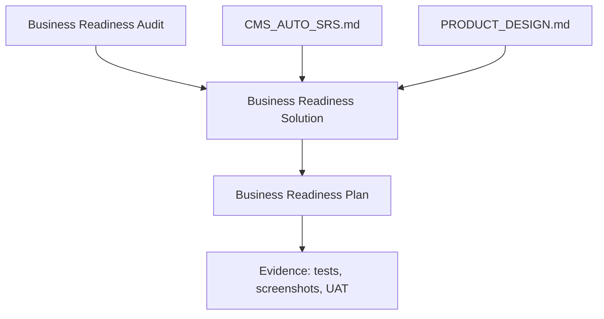

# Business Readiness Solution

Date: 2026-07-02
Companion files:

- Problem list: `docs/BUSINESS_READINESS_AUDIT.md`
- Execution order: `docs/BUSINESS_READINESS_PLAN.md`
- Contract source: `docs/CMS_AUTO_SRS.md`

## Direction

Finish the complaint MVP first. The dealership accountability screens can stay,
but they should not define acceptance until the complaint MVP gates pass:
intake, workflow, SLA, audit, portal privacy, reports, attachments,
notifications, Arabic/English, and UAT proof.

The lazy rule is simple: reuse the backend services that already exist before
adding new product surface. Most gaps are UI wiring, missing side-effect calls,
or explicit scope decisions.

## Solution Principles

1. Backend remains the authority for state, scope, masking, SLA, audit, and
   portal verification.
2. UI never shows placeholder business data on a real route. It shows real data,
   empty state, unavailable state, or error state.
3. Customer portal access is useful only after verification succeeds and never
   exposes internal comments, DMS codes, audit, staff PII, or unrelated cases.
4. Management-readonly gets aggregate visibility by default. Row-level PII is
   masked unless a separate permission grants it.
5. A report is either delivered with its required outputs or visibly deferred
   with signed business approval.
6. Every slice ships with one proof path: API test, web test, screenshot, or UAT
   script, depending on risk.

## Target System Shape

## BIZ-P0-01 - Portal Tracking OTP Delivery

Target behavior:

- Customer enters reference number and phone.
- System rate-limits by reference, phone, and IP/session.
- System creates an OTP, stores only its hash, and sends the plaintext OTP once
  through an approved customer channel.
- Verification accepts only the correct, unexpired OTP and returns a portal
  session token.
- Tracking page shows only public-safe complaint status, public updates, and
  allowed follow-up actions.

Minimal solution:

- Keep `PortalService` as the verification authority.
- Add delivery through the existing notification adapter path instead of creating
  a special OTP transport.
- Use one customer template code for OTP delivery, with Arabic and English
  content.
- Keep the current hash-only persistence rule.
- Add tests that prove the OTP is never returned from the API or logged.

Likely files:

- `apps/api/src/modules/portal/portal.service.ts`
- `apps/api/src/modules/notifications/*`
- `apps/web/src/components/portal-tracking/index.tsx`
- `apps/web/src/i18n/portal-tracking.ts`

Acceptance:

- UAT customer receives a code through the approved channel.
- Wrong, expired, exhausted, and unknown verification attempts fail safely.
- Portal tracking is impossible with reference number alone.
- Arabic and English messages work.

Proof:

- `corepack pnpm test:api -- portal.tracking`
- `corepack pnpm test:api -- notifications`
- `corepack pnpm test:e2e -- customer-portal-track`, if registered
- Screenshot of successful OTP flow in English and Arabic.

## BIZ-P0-02 - Initial Submission SLA and Acknowledgement

Target behavior:

- A submitted complaint immediately has status history, audit, case record, SLA
  deadline event, and acknowledgement notification after commit.
- Draft complaints do not start active SLA obligations.
- Portal and staff submissions follow the same backend-owned submit rule.

Minimal solution:

- Reuse the existing workflow side-effect helper for creation into `SUBMITTED`.
- Keep side effects after transaction commit.
- Do not add a second SLA implementation for create paths.

Likely files:

- `apps/api/src/modules/complaints/complaints.service.ts`
- `apps/api/src/modules/complaints/complaint-workflow-side-effects.ts`
- `apps/api/src/modules/sla/*`
- `apps/api/src/modules/notifications/*`

Acceptance:

- Staff-created submitted complaint has a stage SLA deadline event.
- Portal-created complaint has a stage SLA deadline event.
- Draft complaint has no active SLA deadline.
- Warning and breach jobs can find the new deadline.

Proof:

- `corepack pnpm test:api -- workflow`
- `corepack pnpm test:api -- sla`, if registered
- Seeded UAT showing warning and breach for a newly submitted complaint.

## BIZ-P0-03 - Real Audit Viewer

Target behavior:

- Admin opens `/audit`, searches by actor, action, target, event type, date range,
  and correlation ID.
- Results come from the backend audit search API.
- Export uses the backend audit export API and records an export audit event.
- Empty, loading, error, and denied states are clear.

Minimal solution:

- Reuse `AuditSearchService` and existing controller routes.
- Replace placeholder rows with API data.
- Keep export capped and redacted by the backend.

Likely files:

- `apps/web/src/components/audit-viewer/index.tsx`
- `apps/web/src/app/(staff)/audit/page.tsx`
- `apps/api/src/modules/audit/*`
- `apps/web/src/lib/*audit*`, if a client file already exists or is needed.

Acceptance:

- Admin can search audit logs.
- User without audit permission sees denial or no route access.
- Export downloads redacted data and writes an audit event.
- No password, OTP, token, hash, or provider secret appears.

Proof:

- `corepack pnpm test:api -- audit`
- Docker append-only proof when Docker is available.
- `corepack pnpm test:e2e -- accessibility`
- Audit viewer screenshot in English and Arabic.

## BIZ-P0-04 - Report Delivery and Deferral

Target behavior:

- Reports page clearly separates delivered reports, generic operational rows,
  and signed deferrals.
- Each delivered report has the filters and outputs required by the SRS matrix.
- Export labels match the actual data exported.

Minimal solution:

- Do not build all report types at once unless business refuses deferrals.
- First, make deferrals explicit and signed.
- For delivered MVP reports, add only the outputs UAT actually checks.

Likely files:

- `apps/api/src/modules/reports/report-matrix.ts`
- `apps/api/src/modules/reports/reports.service.ts`
- `apps/web/src/components/reports-dashboard/index.tsx`
- `apps/web/src/i18n/staff-reports-dashboard.ts`

Acceptance:

- RPT-001 through RPT-017 each shows `delivered` or `deferred with signoff`.
- Management export respects scope and creates audit.
- UAT sample counts reconcile with complaint records.

Proof:

- `corepack pnpm test:api -- reports`
- `corepack pnpm test:web -- localization`
- Report screenshots desktop/tablet/mobile.

## BIZ-P0-05 - Management-Readonly Masking

Target behavior:

- Management-readonly can view aggregate dashboards and scoped reports.
- By default, row-level customer phone, email, VIN, plate, staff private contact,
  compensation notes, and attachment filenames are masked.
- Export with sensitive fields requires an explicit permission.

Minimal solution:

- Mask at the API response layer, not in React.
- Reuse the existing server principal and permission model.
- Keep UI labels honest: masked means masked, not missing.

Likely files:

- `packages/database/prisma/role-permissions.ts`
- `apps/api/src/modules/complaints/complaints.service.ts`
- `apps/api/src/modules/reports/*`
- `apps/web/src/app/(staff)/layout.tsx`

Acceptance:

- Management-readonly detail/queue responses do not include unmasked PII.
- CR/branch roles still see fields they are allowed to see.
- Sensitive report export is denied without export/sensitive permission.

Proof:

- `corepack pnpm security:check`
- `corepack pnpm test:api -- reports`
- Focused API tests for allowed and denied masking cases.

## BIZ-P1-01 - Admin Category and SLA Management

Target behavior:

- Admin can list, create, edit, and deactivate categories.
- Admin can see and update active SLA policy values.
- Every change writes config audit.

Minimal solution:

- Wire the existing category endpoints first.
- Add only the SLA fields required for MVP: severity/stage duration, warning
  percent, escalation route, timezone/calendar visibility.
- Avoid a visual policy designer.

Likely files:

- `apps/web/src/components/admin-categories-sla/index.tsx`
- `apps/api/src/modules/admin/admin-categories.controller.ts`
- `apps/api/src/modules/sla/sla.controller.ts`

Acceptance:

- UAT-012 can change a category and SLA value through UI.
- Changes are visible after reload.
- Audit records the configuration change.

Proof:

- `corepack pnpm security:check`
- `corepack pnpm test:api -- admin`
- Admin page screenshot in English and Arabic.

## BIZ-P1-02 - DMS Pilot Mode

Target behavior:

- Business chooses one of two modes before UAT:
  - live/test DMS adapter
  - signed manual-DMS pilot
- Staff always gets a clear result: match, multiple matches, not found,
  provider down, disabled.
- Provider failures are reportable.

Minimal solution:

- If no real DMS is available, sign manual-DMS scope and keep the manual fallback.
- If a test DMS exists, plug it into the existing provider port.
- Persist only safe telemetry needed for RPT-015.

Likely files:

- `apps/api/src/modules/integrations/*`
- `apps/web/src/components/customer-vehicle-lookup/index.tsx`
- `apps/api/src/modules/reports/report-matrix.ts`

Acceptance:

- UAT-001 matched customer/VIN is possible or explicitly waived.
- UAT-002 provider-down/manual complaint is possible.
- DMS disabled state tells Admin what is missing.

Proof:

- `corepack pnpm test:api -- integrations`
- Browser screenshot for match, multiple match, provider down, and manual fallback.

## BIZ-P1-03 - Staff Comments and Public Updates

Target behavior:

- Authorized staff can add internal comments.
- Authorized staff can add public updates.
- Portal shows only public updates after verification.
- Internal comments never reach the portal.

Minimal solution:

- Reuse existing complaint comment routes.
- Add one composer with a visibility control.
- List existing comments in the detail page.

Likely files:

- `apps/web/src/components/complaint-comments-panel/index.tsx`
- `apps/api/src/modules/complaints/complaints.controller.ts`
- `apps/api/src/modules/complaints/complaints.service.ts`
- `apps/web/src/components/portal-tracking/index.tsx`

Acceptance:

- UAT-006 passes.
- Internal note is visible to staff only.
- Public update appears in verified portal tracking.

Proof:

- `corepack pnpm test:api -- workflow`
- `corepack pnpm test:api -- portal.tracking`
- Staff and portal screenshots.

## BIZ-P1-04 - Closure Survey

Target behavior:

- Closing a complaint schedules a one-time survey link.
- Customer submits rating/comment through the portal survey route.
- Authorized staff can see submitted CSAT in complaint detail and reports.

Minimal solution:

- Reuse `SurveysService.scheduleClosureSurvey`.
- Wire close side effect to call the scheduler after commit.
- Wire portal survey form to submit token, rating, and comment.

Likely files:

- `apps/api/src/modules/surveys/surveys.service.ts`
- `apps/api/src/modules/complaints/complaint-workflow-side-effects.ts`
- `apps/web/src/components/portal-survey/index.tsx`
- `apps/web/src/app/portal/survey/page.tsx`

Acceptance:

- UAT-008 schedules survey.
- Used, expired, invalid, and valid survey token states work.
- CSAT is available for authorized reporting.

Proof:

- `corepack pnpm test:api -- surveys`
- Browser survey screenshot.

## BIZ-P1-05 - Staff Intake Attachments

Target behavior:

- Staff can attach evidence during complaint creation.
- Complaint still returns a reference if attachment upload partially fails after
  creation.
- Staff sees which files uploaded and which need retry.

Minimal solution:

- After complaint create succeeds, upload selected files with the existing staff
  attachment API.
- Keep detail-page attachment controls as the retry path.
- Do not create a new multipart complaint endpoint unless current payload size
  becomes a real limit.

Likely files:

- `apps/web/src/components/attachment-upload-panel/index.tsx`
- `apps/web/src/components/complaint-create-form/index.tsx`
- `apps/web/src/lib/staff-attachments-api.ts`
- `apps/api/src/modules/attachments/*`

Acceptance:

- UAT-001 can include evidence at intake.
- Invalid files are rejected before upload.
- Clean files can be downloaded by authorized staff after scan.

Proof:

- `corepack pnpm test:api -- attachments`
- Staff intake screenshot with success and partial failure states.

## BIZ-P1-06 - Compensation Scope

Target behavior:

- Compensation is either explicitly out of MVP or minimally trackable as
  complaint metadata.
- No payment execution or accounting mutation exists in MVP.

Minimal solution:

- Prefer signed deferral unless business confirms compensation tracking is needed
  for UAT.
- If needed, add proposed/approved metadata only, with RBAC and audit.

Likely files:

- `packages/database/prisma/schema.prisma`
- `packages/database/prisma/role-permissions.ts`
- future compensation module or complaint detail section

Acceptance:

- Business signoff says deferred, or authorized users can record metadata.
- Customer-visible compensation communication requires explicit approval.

Proof:

- `corepack pnpm test:api -- compensation`, if implemented.
- Signed deferral if not implemented.

## BIZ-P1-07 - Product Scope Alignment

Target behavior:

- Product acceptance has one priority order.
- Complaint MVP gates are not hidden behind newer accountability screens.
- Staff landing page matches the accepted pilot workflow.

Minimal solution:

- Keep `PRODUCT_DESIGN.md` as future direction.
- Use the SRS complaint MVP as the acceptance contract until signed otherwise.
- Do not delete accountability screens; label them outside complaint MVP proof if
  needed.

Acceptance:

- Stakeholders can say which screens are in pilot acceptance.
- UAT checklist maps to real routes and proof commands.

Proof:

- Signed scope decision.
- Updated UAT checklist when implementation starts.

## Operations Readiness

Before pilot, prove these in a realistic environment:

- Docker/Postgres audit append-only proof.
- S3-compatible attachment upload/download.
- Notification provider configuration and failure retry.
- Backup and restore runbook.
- Arabic and English screenshots for staff and portal flows.

Existing checks:

- `corepack pnpm security:check`
- `corepack pnpm ops:backup:check`
- `corepack pnpm openapi:check`
