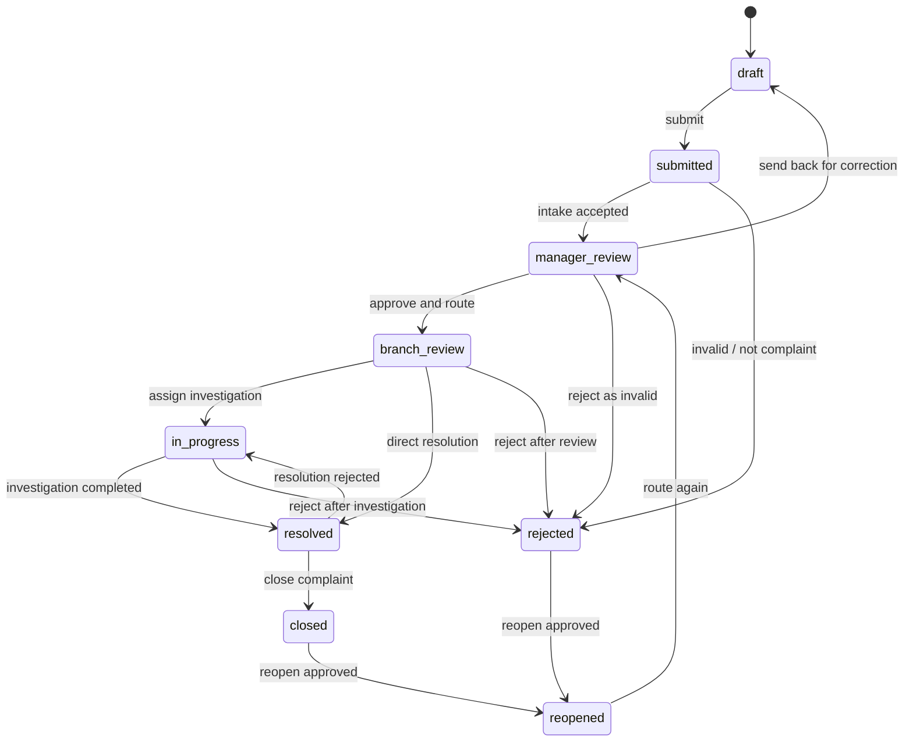

# CMS-Auto Software Requirements Specification

---
project: CMS-Auto
version: 1.0-vendor-ready
status: vendor-ready draft
language: en
source: Reworked from Arabic SRS for automotive dealership complaint management
platforms:
- web
- responsive mobile web
stack:
- Next.js
- NestJS
- PostgreSQL
- Redis
- OpenAPI 3.1
defaultProof: L2
---

## Contract Review Changelog

- 2026-06-18: Clarified RBAC, workflow rejection authority, compensation permissions, CSAT scale, portal anti-abuse, password reset UI, notification center UI, attachment defaults, RTO, DMS multiple-match behavior, inquiry/suggestion/feedback handling, first-response KPI source, total SLA target, optimistic concurrency for complaint updates, the modern operational UI/UX quality bar, QA UI coverage, and UI sign-off gates.

# 0. Executive Readiness and Vendor Contract Rules

### CONTRACT-READINESS-001: Interpretation hierarchy
type: contract-control
status: active
priority: must

This SRS is intended to be used as a vendor-facing delivery contract, not only as an internal technical brief. If there is a conflict between a general statement and a numbered acceptance criterion, the numbered acceptance criterion controls. If there is a conflict between a feature description and a security, audit, or RBAC requirement, the stricter security, audit, or RBAC requirement controls.

#### Acceptance Criteria
- AC1 [must] Vendor estimates, delivery plans, invoices, and acceptance demos must reference requirement IDs from this SRS.
- AC2 [must] Any excluded item must be explicitly listed in the commercial proposal as out of scope.
- AC3 [must] Ambiguous functionality must be clarified through a written change request before implementation.
- AC4 [must] No verbal approval overrides this SRS unless captured in an approved change record.

### CONTRACT-READINESS-002: Definition of Done

type: contract-control
status: active
priority: must

A requirement is not considered delivered until it is implemented, tested, documented where needed, demonstrated to the business owner, and accepted against its acceptance criteria.

#### Minimum Done Checklist
- Code is merged into the agreed repository branch.
- Database migration is committed and repeatable.
- API behavior is documented in OpenAPI/Swagger when applicable.
- Automated tests listed in the Proof Requirements pass.
- UI behavior is demonstrated using realistic automotive complaint data.
- RBAC and branch-scope behavior are proven for at least one allowed and one denied case.
- Audit log entries are visible for workflow, security, and configuration changes.
- Arabic RTL and English LTR are verified for user-facing screens.
- Known limitations are documented before UAT.

### CONTRACT-READINESS-003: MVP acceptance gates

type: contract-control
status: active
priority: must

The MVP must pass the following gates before pilot sign-off.

| Gate | Required Evidence | Blocking? |
|---|---|---|
| Architecture baseline | Build, lint, typecheck, test, OpenAPI check pass | Yes |
| Security baseline | Password hashing, session cookies, CSRF, rate limit, RBAC tests | Yes |
| Complaint lifecycle | End-to-end demo from creation to closure and reopen | Yes |
| SLA and escalation | SLA warning and breach jobs demonstrated with test clock or seeded dates | Yes |
| Auditability | Audit viewer shows auth, complaint, workflow, comment, attachment, and admin actions | Yes |
| Customer portal privacy | Portal cannot expose internal comments, audit logs, or unrelated complaints | Yes |
| Reports | Operational dashboard and export respect branch/role filters | Yes |
| Backup/restore | Staging backup and restore procedure tested | Yes |
| Arabic/English | Key staff and portal screens support RTL/LTR without layout breakage | Yes |
| UI/UX quality | Design tokens/components in use, visual regression reviewed, WCAG 2.1 AA checks pass, and frontend performance budgets pass | Yes |
| UAT closure | Signed UAT checklist with open defects classified by severity | Yes |

### CONTRACT-READINESS-004: Change control

type: contract-control
status: active
priority: must

Any change to scope, workflow authority, integration behavior, security model, reports, or data ownership must be handled through an approved change request.

#### Change Request Fields
- Change request ID.
- Requested by.
- Date requested.
- Business reason.
- Impacted requirement IDs.
- Impact on timeline.
- Impact on cost.
- Security/privacy impact.
- Data migration impact.
- Approval status.
- Approved by.


# 1. Product Contract

### PILLAR-001: Complaint ownership is auditable
type: pillar
status: active

Every complaint must have a clear current owner, visible status, immutable history, and traceable decision path from intake to closure.

### PILLAR-002: The system is an operating tool, not a marketing page
type: pillar
status: active

The user interface must prioritize dense work queues, clear status, fast action, and repeatable operations for customer relations teams.

### PILLAR-003: Integrations are adapters, not the domain core
type: pillar
status: active

DMS, CRM, SMS, WhatsApp, email, and future third-party systems must connect through explicit integration adapters. The complaint workflow must remain testable without live external systems.

### PILLAR-004: Security and privacy are default behavior
type: pillar
status: active

Customer data, complaint details, attachments, audit logs, and employee actions are sensitive. Access must be role-based, logged, and minimized.

### PILLAR-005: MVP is workflow reliability before intelligence
type: pillar
status: active

The first production-ready system must solve intake, routing, SLA, closure, notifications, audit, and reporting before AI, chatbot, native mobile apps, or advanced analytics.

# 2. Glossary

- Complaint: A formal customer dissatisfaction record that requires investigation, action, and closure.
- Inquiry: A customer request for information that does not require the full complaint workflow.
- Suggestion: A customer improvement idea with a simplified handling path.
- Feedback: General positive or negative customer note.
- CR Officer: Customer Relations Officer who creates and follows complaints.
- CR Manager: Customer Relations Manager who reviews, approves, assigns, and monitors complaints.
- Branch Manager: Branch-level manager responsible for final resolution and closure authority.
- Admin: System administrator responsible for users, roles, branches, categories, SLA, and templates.
- Management Read-Only: Authorized management user who can view scoped operational dashboards and reports without mutating complaint, customer, configuration, or audit data. Sensitive fields are masked unless an explicit export/view permission is granted.
- Customer: External customer who can submit or track a complaint through the portal.
- DMS: Dealer Management System, the source for customer, vehicle, sale, and service lookup.
- SLA: Service Level Agreement defining allowed handling time.
- TAT: Turnaround time from complaint creation to closure.
- CSAT: Customer satisfaction score after closure, using a 1-5 scale where 1 means very dissatisfied and 5 means very satisfied.
- Audit Trail: Immutable record of actions and state changes.

# 3. Product Scope

## In Scope

- Staff login with database-backed credentials.
- Role-based access for CR Officer, CR Manager, Branch Manager, Admin, and read-only management.
- Customer, vehicle, branch, category, severity, and complaint master data.
- Internal complaint creation by staff.
- Customer web portal complaint creation and tracking.
- Complaint workflow from draft/intake through approval, assignment, investigation, resolution, closure, and reopen.
- SLA timers, warning thresholds, and auto-escalation.
- Email, SMS, in-app, and WhatsApp-ready notification adapters.
- Attachments with secure object storage.
- Full audit log for complaint, workflow, user, and configuration changes.
- Operational reports and dashboards.
- OpenAPI/Swagger documentation for all backend APIs.
- Arabic RTL and English LTR UI support.
- Docker-based local and deployment packaging.

## Out of Scope for MVP

- Full CRM replacement.
- Accounting, inventory, HR, or full DMS implementation.
- Native iOS/Android apps.
- AI classification, sentiment analysis, churn prediction, chatbot, image recognition, voice transcription, or executive AI assistant.
- Visual workflow designer.
- External developer marketplace.
- Kubernetes production requirement before Docker deployment is stable.
- Payment handling or financial compensation execution.

# 4. Architecture Contracts

### ARCH-STACK-001: Runtime stack
type: architecture
lane: T4_ARCHITECTURE
risk: high
status: active
requiredStack:
- next
- nestjs
- typescript
- postgresql
- redis
- openapi
- swagger
- docker
expectedStack:
- prisma
- bullmq
- playwright
- jest
- eslint
- prettier
- s3-compatible object storage
forbidden:
- mongodb as primary database
- microservices for MVP
- client-side-only auth
- business workflow logic in React components
- direct DMS calls from frontend

#### Decision
CMS-Auto uses a TypeScript modular monolith with a Next.js frontend, NestJS backend, PostgreSQL database, Redis-backed jobs, OpenAPI 3.1 contract, Swagger UI, and Docker packaging.

#### Rationale
The domain needs strong workflow consistency, auditability, reporting, and integration boundaries. A modular monolith is simpler to prove and operate than premature microservices while still allowing later extraction of modules.

#### Architecture Constraints
- Backend modules own business rules; frontend components may call APIs but must not implement workflow authority.
- PostgreSQL is the system of record for complaint, user, branch, category, SLA, audit, and configuration data.
- Redis is used for cache, queues, and scheduled jobs, not as source of truth.
- External systems are accessed through backend adapters only.
- Every package must be buildable and testable through repository scripts.

#### Acceptance Criteria
- AC1 [must] Repository contains separate web, api, database, and contract boundaries.
- AC2 [must] Backend build compiles with strict TypeScript.
- AC3 [must] Frontend build compiles with strict TypeScript.
- AC4 [must] Forbidden runtime/database architecture choices are absent.

#### Proof Requirements
minimum: L2
preferred: L3
commands:
- npm run build
- npm run lint
- npm run test
- npm run openapi:check

### ARCH-AUTH-001: Simple database-backed authentication
type: architecture
lane: T4_ARCHITECTURE
risk: high
status: active
requiredStack:
- argon2
- http-only cookies
- server-side session validation
expectedStack:
- csrf protection
- rate limiting
forbidden:
- localStorage access tokens
- plain text passwords
- client-trusted roles
- external SSO as MVP dependency

#### Decision
MVP authentication uses local database users with email or username plus password. Passwords are hashed with Argon2id. Sessions are stored server-side or signed with a secure HttpOnly cookie and validated by the API.

#### Architecture Constraints
- Staff users authenticate with database credentials.
- Role and branch permissions are loaded from the database on the server.
- Password reset must use time-limited single-use tokens.
- Login, logout, password reset, and failed attempts must be audit logged.

#### Acceptance Criteria
- AC1 [must] Login succeeds only with valid active database user credentials.
- AC2 [must] Password hashes are never returned by any API.
- AC3 [must] Inactive or locked users cannot authenticate.
- AC4 [must] Role claims used by the UI are derived from server authorization, not client input.

#### Proof Requirements
minimum: L2
preferred: L3
commands:
- npm run test:api -- auth
- npm run test:e2e -- auth
- npm run security:check

### ARCH-API-001: OpenAPI and Swagger API contract
type: architecture
lane: T4_ARCHITECTURE
risk: high
status: active
requiredStack:
- openapi
- swagger
expectedStack:
- request validation
- response schema validation
forbidden:
- undocumented public API endpoints
- breaking response changes without contract update

#### Decision
All backend REST APIs are documented with OpenAPI 3.1 and exposed through Swagger UI in non-production environments and protected internal documentation environments.

#### Architecture Constraints
- Every route must declare request, response, error, and auth behavior.
- OpenAPI generation must be part of CI.
- API contract drift must fail checks before release.
- External integrations consume stable adapter APIs, not internal database tables.

#### Acceptance Criteria
- AC1 [must] Swagger UI lists auth, complaint, workflow, notification, report, and admin endpoints.
- AC2 [must] API schemas include validation errors and authorization errors.
- AC3 [must] OpenAPI checks fail if generated contract differs from committed contract.

#### Proof Requirements
minimum: L2
commands:
- npm run openapi:generate
- npm run openapi:check
- npm run test:api

### ARCH-DATA-001: PostgreSQL domain model and migrations
type: architecture
lane: T4_ARCHITECTURE
risk: high
status: active
requiredStack:
- postgresql
- prisma
expectedStack:
- database migrations
- seed data
forbidden:
- schema changes without migration
- business-critical state stored only in JSON blobs
- destructive migrations without rollback plan

#### Decision
PostgreSQL stores normalized core domain data. Prisma manages schema, migrations, and typed database access. Raw SQL is allowed for reporting only when reviewed and tested.

#### Architecture Constraints
- Core tables include users, roles, branches, customers, vehicles, complaints, complaint status history, approvals, attachments, comments, SLA policies, notifications, surveys, and audit logs.
- Complaint status transitions must be persisted as history.
- Audit logs must be append-only from application behavior.
- Soft delete is required for business records that must remain auditable.

#### Acceptance Criteria
- AC1 [must] Database migrations create all MVP core tables.
- AC2 [must] Foreign keys preserve complaint relationships.
- AC3 [must] Audit log data cannot be overwritten by ordinary update flows.

#### Proof Requirements
minimum: L2
commands:
- npm run db:migrate:test
- npm run test:api -- database

### ARCH-WORKFLOW-001: Complaint state machine
type: architecture
lane: T4_ARCHITECTURE
risk: high
status: active
requiredStack:
- explicit state machine
expectedStack:
- transition guards
forbidden:
- free-text status authority
- UI-only workflow validation

#### Decision
Complaint lifecycle is controlled by an explicit backend state machine with named states, allowed transitions, role guards, required comments, and side effects.

#### Architecture Constraints
- The API is the only authority for status transitions.
- Invalid transitions return deterministic validation errors.
- Every transition writes complaint status history and audit log entries.
- Notification and SLA side effects are scheduled through jobs after the state change is committed.

#### Acceptance Criteria
- AC1 [must] Default complaint flow supports draft, submitted, manager_review, branch_review, in_progress, resolved, closed, rejected, and reopened states.
- AC2 [must] Invalid role or invalid state transition is rejected.
- AC3 [must] Every successful transition is recorded in history.

#### Proof Requirements
minimum: L2
preferred: L3
commands:
- npm run test:api -- workflow
- npm run test:e2e -- complaint-lifecycle

### ARCH-INTEGRATION-001: External integration adapters
type: architecture
lane: T4_ARCHITECTURE
risk: high
status: active
expectedStack:
- dms adapter
- crm adapter
- sms adapter
- whatsapp adapter
- email adapter
forbidden:
- frontend calls to DMS
- hardcoded provider credentials
- provider-specific logic in domain services

#### Decision
External systems are connected through backend adapters with stable internal interfaces and test doubles.

#### Architecture Constraints
- DMS lookup failure must not block manual complaint creation when required fields are entered manually.
- Notification providers are replaceable without changing complaint workflow code.
- Integration requests and failures are logged with correlation IDs.
- Provider credentials are loaded from environment or secret manager only.

#### Acceptance Criteria
- AC1 [must] DMS customer lookup has success, not-found, and provider-down paths.
- AC2 [must] Notification sending can be tested with an in-memory provider.
- AC3 [must] Provider failures are visible without corrupting complaint state.

#### Proof Requirements
minimum: L2
commands:
- npm run test:api -- integrations
- npm run test:api -- notifications

### ARCH-FILES-001: Secure attachment storage
type: architecture
lane: T4_ARCHITECTURE
risk: high
status: active
requiredStack:
- s3-compatible object storage
expectedStack:
- file type validation
- malware scan hook
forbidden:
- storing attachments in the database
- public unauthenticated attachment URLs
- executable uploads

#### Decision
Complaint attachments are stored in S3-compatible object storage with metadata in PostgreSQL. Access is authorized through the backend.

#### Architecture Constraints
- Uploads validate size, content type, extension, and ownership.
- Download URLs are short-lived and authorized.
- Attachments belong to complaint records and are audit logged.
- Malware scanning may be asynchronous but must expose pending, clean, and rejected states.

#### Acceptance Criteria
- AC1 [must] Allowed image, PDF, audio, and video attachments can be uploaded within configured limits.
- AC2 [must] Disallowed executable attachments are rejected.
- AC3 [must] Unauthorized users cannot read complaint attachments.

#### Proof Requirements
minimum: L2
commands:
- npm run test:api -- attachments
- npm run test:e2e -- attachments

### ARCH-UI-001: Operational SaaS interface
type: architecture
lane: T4_ARCHITECTURE
risk: medium
status: active
requiredStack:
- next
- responsive web
expectedStack:
- rtl support
- accessible components
forbidden:
- marketing-style landing page as primary product UI
- hidden workflow actions
- low-density dashboard-only navigation

#### Decision
The first screen after login is a role-specific work queue and dashboard, not a marketing page. The UI is quiet, dense, scannable, Arabic/English capable, and optimized for repeated operational use.

#### Architecture Constraints
- Staff pages show queue, status, SLA, owner, severity, and next action clearly.
- Complaint detail pages keep timeline, comments, attachments, customer data, and workflow actions in predictable locations.
- Arabic RTL must be supported from the beginning.
- UI controls must use familiar form, table, tab, modal, filter, and action patterns.

#### Acceptance Criteria
- AC1 [must] CR Officer can see assigned queue and create a complaint from the main navigation.
- AC2 [must] Manager roles can see pending approvals and overdue complaints.
- AC3 [must] Customer portal is responsive on mobile browser.

#### Proof Requirements
minimum: L2
preferred: L3
commands:
- npm run test:web
- npm run test:e2e -- ui-smoke

# 5. Functional Requirements

### REQ-AUTH-001: Staff login and logout
type: functional
lane: T2_STANDARD
risk: high
priority: must
status: active
source: original FR-001, FR-004, FR-006

#### Intent
Staff users can log in with database credentials, receive an authenticated session, and log out safely.

#### Scope Hints
likelyEdit:
- apps/api/src/auth/**
- apps/web/src/app/login/**
- packages/database/**
likelyTest:
- apps/api/test/auth/**
- apps/web/e2e/auth/**
forbidden:
- external SSO dependency
- localStorage token storage
- unaudited login failure handling

#### Non-Goals
- Do not implement Azure AD, LDAP, or SSO in MVP.
- Do not implement customer social login.

#### Acceptance Criteria
- AC1 [must] Active staff user can log in with correct username or email and password.
- AC2 [must] Incorrect credentials return a generic error without revealing which field failed.
- AC3 [must] Logout invalidates the active session.
- AC4 [must] Locked or inactive users cannot log in.
- AC5 [must] Login success, login failure, logout, lock, and password reset events are audit logged.
- AC6 [must] Self-service password reset uses a time-limited, single-use token and generic success/failure messaging.

#### Proof Requirements
minimum: L2
preferred: L3
commands:
- npm run test:api -- auth
- npm run test:e2e -- auth

### REQ-RBAC-001: Role and permission enforcement
type: functional
lane: T2_STANDARD
risk: high
priority: must
status: active
source: original section 3

#### Intent
Users can only view and act on complaints, settings, reports, and audit data permitted by their role and branch scope.

#### Scope Hints
likelyEdit:
- apps/api/src/auth/**
- apps/api/src/users/**
- apps/api/src/complaints/**
- apps/web/src/components/navigation/**
likelyTest:
- apps/api/test/auth/**
- apps/api/test/rbac/**
forbidden:
- client-trusted authorization
- role checks only in frontend

#### Non-Goals
- Do not build a custom rule expression language in MVP.

#### Acceptance Criteria
- AC1 [must] CR Officer can create complaints and work assigned complaints.
- AC2 [must] CR Manager can review and approve complaints in authorized branch or department scope.
- AC3 [must] Branch Manager can resolve and close authorized branch complaints.
- AC4 [must] Admin can manage users, roles, branches, categories, SLA, and templates.
- AC5 [must] Unauthorized API calls return 403 and create an audit/security event.

#### Proof Requirements
minimum: L2
preferred: L3
commands:
- npm run test:api -- rbac
- npm run test:e2e -- permissions

### REQ-ADMIN-001: User, branch, and master data management
type: functional
lane: T2_STANDARD
risk: medium
priority: must
status: active
source: original FR-005, FR-090, FR-091, FR-094

#### Intent
Administrators can manage users, branches, departments, complaint categories, severity levels, and reference lists required by complaint handling.

#### Scope Hints
likelyEdit:
- apps/api/src/admin/**
- apps/api/src/master-data/**
- apps/web/src/app/admin/**
- packages/database/**
likelyTest:
- apps/api/test/admin/**
- apps/web/e2e/admin/**
forbidden:
- editing audit logs
- deleting complaint-linked master data without replacement

#### Non-Goals
- Do not implement HR system synchronization in MVP.

#### Acceptance Criteria
- AC1 [must] Admin can create, update, deactivate, and reactivate staff users.
- AC2 [must] Admin can create and update branches and departments.
- AC3 [must] Admin can manage hierarchical complaint categories.
- AC4 [must] Master data used by existing complaints cannot be hard-deleted.
- AC5 [must] Master data changes are audit logged.

#### Proof Requirements
minimum: L2
commands:
- npm run test:api -- admin
- npm run test:e2e -- admin-master-data

### REQ-COMPLAINT-001: Internal complaint creation
type: functional
lane: T2_STANDARD
risk: high
priority: must
status: active
source: original FR-010, UC-001

#### Intent
Authorized staff can create a complaint with customer, vehicle, category, severity, branch, subject, description, incident date, and optional attachments.

#### Scope Hints
likelyEdit:
- apps/api/src/complaints/**
- apps/web/src/app/complaints/new/**
- packages/database/**
likelyTest:
- apps/api/test/complaints/**
- apps/web/e2e/complaints/**
forbidden:
- workflow approval implementation beyond initial submitted state
- DMS writeback

#### Non-Goals
- Do not implement AI classification.
- Do not implement compensation approval.
- Do not implement customer portal creation in this requirement.

#### Acceptance Criteria
- AC1 [must] Complaint creation requires customer name, phone or customer number, category, subcategory, description, incident date, branch, subject, and severity.
- AC2 [must] Vehicle VIN is required only when the complaint is vehicle-related.
- AC3 [must] Missing required fields return field-specific validation messages.
- AC4 [must] Successful creation assigns a unique complaint reference number.
- AC5 [must] Created complaint is visible in the creator's work queue.

#### Proof Requirements
minimum: L2
preferred: L3
commands:
- npm run test:api -- complaints.create
- npm run test:e2e -- complaint-create

### REQ-CUSTOMER-001: Customer and vehicle lookup with manual fallback
type: functional
lane: T2_STANDARD
risk: medium
priority: must
status: active
source: original FR-011

#### Intent
Staff can search existing customer and vehicle records from local data and DMS adapter results, while manual entry remains possible when lookup fails.

#### Scope Hints
likelyEdit:
- apps/api/src/customers/**
- apps/api/src/integrations/dms/**
- apps/web/src/components/customer-lookup/**
likelyTest:
- apps/api/test/customers/**
- apps/api/test/integrations/**
forbidden:
- blocking complaint creation when DMS is unavailable
- direct frontend DMS calls

#### Non-Goals
- Do not implement DMS writeback in MVP.

#### Acceptance Criteria
- AC1 [must] Staff can search by phone, customer number, VIN, or name.
- AC2 [must] Matching customer and vehicle records can populate complaint fields.
- AC3 [must] DMS outage shows a clear warning and allows manual customer entry.
- AC4 [must] Manual entries are marked as manually entered for later reconciliation.
- AC5 [must] Multiple DMS matches are shown as selectable results with enough distinguishing fields to choose the correct customer or vehicle.

#### Proof Requirements
minimum: L2
commands:
- npm run test:api -- customers
- npm run test:api -- dms-adapter

### REQ-COMPLAINT-002: Complaint classification and severity
type: functional
lane: T2_STANDARD
risk: medium
priority: must
status: active
source: original FR-012, FR-013

#### Intent
Complaints are classified using configured category trees and severity values that drive SLA and reporting.

#### Scope Hints
likelyEdit:
- apps/api/src/categories/**
- apps/api/src/complaints/**
- apps/web/src/components/complaint-form/**
likelyTest:
- apps/api/test/categories/**
- apps/api/test/complaints/**
forbidden:
- hardcoded categories in UI
- AI classification as authority

#### Non-Goals
- Do not implement machine learning classification in MVP.

#### Acceptance Criteria
- AC1 [must] Complaint categories support at least two levels.
- AC2 [must] Complaint severity supports Critical, High, Medium, and Low.
- AC3 [must] Category and severity values are admin-configurable.
- AC4 [must] Severity selection determines default SLA policy.

#### Proof Requirements
minimum: L2
commands:
- npm run test:api -- categories
- npm run test:e2e -- complaint-classification

### REQ-COMPLAINT-003: Drafts, duplicates, and related complaints
type: functional
lane: T2_STANDARD
risk: medium
priority: should
status: active
source: original FR-016, FR-017, FR-027

#### Intent
Staff can save complaint drafts, detect likely duplicate complaints, and link related complaints without merging audit histories.

#### Scope Hints
likelyEdit:
- apps/api/src/complaints/**
- apps/web/src/app/complaints/**
likelyTest:
- apps/api/test/complaints/**
forbidden:
- automatic destructive merge
- deleting original complaint records

#### Non-Goals
- Do not implement advanced pattern detection or AI duplicate matching in MVP.

#### Acceptance Criteria
- AC1 [must] Staff can save a complaint draft before submission.
- AC2 [must] Draft complaints are not counted as active SLA complaints.
- AC3 [should] System warns about likely duplicates based on customer, category, branch, and recent time window.
- AC4 [must] Authorized users can link related complaints while preserving separate histories.

#### Proof Requirements
minimum: L2
commands:
- npm run test:api -- complaints.drafts
- npm run test:api -- complaints.related

### REQ-WORKFLOW-001: Default complaint approval workflow
type: functional
lane: T2_STANDARD
risk: high
priority: must
status: active
source: original FR-020, UC-002, UC-003

#### Intent
A submitted complaint follows the default approval flow from CR Officer to CR Manager to Branch Manager.

#### Scope Hints
likelyEdit:
- apps/api/src/workflow/**
- apps/api/src/complaints/**
- apps/web/src/app/complaints/[id]/**
likelyTest:
- apps/api/test/workflow/**
- apps/web/e2e/workflow/**
forbidden:
- hardcoded frontend-only workflow
- status changes without history

#### Non-Goals
- Do not build custom workflow designer in MVP.
- Do not implement parallel processing in this requirement.

#### Acceptance Criteria
- AC1 [must] CR Officer can submit a complaint for manager review.
- AC2 [must] CR Manager can approve and forward to Branch Manager.
- AC3 [must] CR Manager can send back with required reason.
- AC4 [must] Branch Manager can assign investigation, resolve, or close within allowed transitions.
- AC5 [must] Every transition records actor, timestamp, previous state, new state, and comment where required.

#### Proof Requirements
minimum: L2
preferred: L3
commands:
- npm run test:api -- workflow.default
- npm run test:e2e -- complaint-lifecycle

### REQ-WORKFLOW-002: Conditional routing and delegation
type: functional
lane: T2_STANDARD
risk: high
priority: should
status: active
source: original FR-021, FR-023, FR-024

#### Intent
The workflow can route complaints differently by severity, category, branch, VIP flag, safety flag, or delegated manager assignment.

#### Scope Hints
likelyEdit:
- apps/api/src/workflow/**
- apps/api/src/routing/**
- apps/web/src/app/admin/workflow/**
likelyTest:
- apps/api/test/workflow/**
forbidden:
- visual workflow designer
- arbitrary script execution in routing rules

#### Non-Goals
- Do not implement drag-and-drop workflow designer in MVP.

#### Acceptance Criteria
- AC1 [must] Critical complaints route to CR Manager and Branch Manager with priority indicators.
- AC2 [must] Safety-related complaints can require additional management visibility.
- AC3 [must] Delegation allows an authorized substitute to act during configured dates.
- AC4 [should] Parallel review can be represented as multiple required approvals for configured categories without adding a separate complaint state.

#### Proof Requirements
minimum: L2
commands:
- npm run test:api -- workflow.routing

### REQ-SLA-001: SLA timers and escalation
type: functional
lane: T2_STANDARD
risk: high
priority: must
status: active
source: original FR-025, section 14

#### Intent
The system tracks SLA deadlines per complaint stage and severity, warns before breach, and escalates overdue complaints.

#### Scope Hints
likelyEdit:
- apps/api/src/sla/**
- apps/api/src/jobs/**
- apps/api/src/notifications/**
- apps/web/src/components/sla/**
likelyTest:
- apps/api/test/sla/**
- apps/api/test/jobs/**
forbidden:
- client-side-only SLA timers
- silent SLA breach

#### Non-Goals
- Do not implement predictive SLA risk scoring in MVP.

#### Acceptance Criteria
- AC1 [must] Critical complaints default to 2 hours per stage.
- AC2 [must] High complaints default to 8 hours per stage.
- AC3 [must] Medium complaints default to 24 hours per stage.
- AC4 [must] Low complaints default to 72 hours per stage.
- AC5 [must] At 80 percent of SLA time, current owner receives warning notification.
- AC6 [must] At breach, complaint escalates according to configured escalation levels.

#### Proof Requirements
minimum: L2
preferred: L3
commands:
- npm run test:api -- sla
- npm run test:api -- escalation

### REQ-RESOLUTION-001: Resolution, closure, and reopen
type: functional
lane: T2_STANDARD
risk: high
priority: must
status: active
source: original FR-030, FR-031, FR-033, FR-035

#### Intent
Authorized users can document corrective action, resolve the complaint, close it officially, and reopen it when permitted.

#### Scope Hints
likelyEdit:
- apps/api/src/complaints/**
- apps/api/src/workflow/**
- apps/web/src/app/complaints/[id]/**
likelyTest:
- apps/api/test/complaints/**
- apps/web/e2e/resolution/**
forbidden:
- closing without resolution summary
- deleting closed complaint history

#### Non-Goals
- Do not execute compensation payments.

#### Acceptance Criteria
- AC1 [must] Resolution requires action summary, resolution type, and responsible actor.
- AC2 [must] Closure records final state, closure timestamp, and closing manager.
- AC3 [must] Closed complaints are read-only except reopen and authorized administrative correction flows.
- AC4 [must] Reopen requires reason and creates a new workflow history entry.
- AC5 [must] Closure triggers satisfaction survey scheduling.

#### Proof Requirements
minimum: L2
commands:
- npm run test:api -- resolution
- npm run test:e2e -- resolution

### REQ-COMPENSATION-001: Compensation record tracking
type: functional
lane: T2_STANDARD
risk: medium
priority: should
status: active
source: original FR-032

#### Intent
Users can record proposed or approved compensation as complaint metadata without executing financial payment.

#### Scope Hints
likelyEdit:
- apps/api/src/complaints/**
- apps/web/src/app/complaints/[id]/**
likelyTest:
- apps/api/test/complaints/**
forbidden:
- payment execution
- accounting ledger mutation

#### Non-Goals
- Do not integrate with accounting or payment systems in MVP.

#### Acceptance Criteria
- AC1 [must] Compensation type, amount or description, approval status, and approving actor can be recorded.
- AC2 [must] Compensation changes are audit logged.
- AC3 [must] Compensation fields are visible only to authorized staff roles.

#### Proof Requirements
minimum: L2
commands:
- npm run test:api -- compensation

### REQ-COMMENTS-001: Internal and public comments
type: functional
lane: T2_STANDARD
risk: medium
priority: must
status: active
source: original FR-028

#### Intent
Complaint users can add internal notes and customer-visible messages with clear visibility boundaries.

#### Scope Hints
likelyEdit:
- apps/api/src/comments/**
- apps/web/src/components/comments/**
likelyTest:
- apps/api/test/comments/**
forbidden:
- leaking internal comments to customer portal
- editing comments without audit

#### Non-Goals
- Do not implement real-time chat in MVP.

#### Acceptance Criteria
- AC1 [must] Internal comments are visible only to authorized staff.
- AC2 [must] Public comments are visible in customer portal when explicitly marked public.
- AC3 [must] Comment creation records author, timestamp, visibility, and complaint ID.
- AC4 [must] Edited comments preserve audit history.
- AC5 [must] The first staff public response timestamp is captured for reporting.

#### Proof Requirements
minimum: L2
commands:
- npm run test:api -- comments
- npm run test:e2e -- complaint-comments

### REQ-PORTAL-001: Customer complaint submission
type: functional
lane: T2_STANDARD
risk: medium
priority: must
status: active
source: original FR-050, UC-004

#### Intent
Customers can submit a complaint through a responsive web portal without staff intervention.

#### Scope Hints
likelyEdit:
- apps/web/src/app/portal/**
- apps/api/src/portal/**
- apps/api/src/complaints/**
likelyTest:
- apps/api/test/portal/**
- apps/web/e2e/portal/**
forbidden:
- staff-only fields exposed to customers
- native mobile app
- unrate-limited public submission endpoint

#### Non-Goals
- Do not implement native iOS or Android app in MVP.
- Do not implement chatbot submission.

#### Acceptance Criteria
- AC1 [must] Customer can submit name, phone, branch, category, description, incident date, and attachments.
- AC2 [must] Portal returns a complaint reference number immediately after successful submission.
- AC3 [must] Portal validates required fields with clear messages.
- AC4 [must] Customer-submitted complaints enter the same backend workflow as staff complaints.
- AC5 [must] Portal submission is rate limited by IP/session and phone number where available.
- AC6 [must] Public submission can enable CAPTCHA or equivalent abuse protection before internet launch without changing complaint workflow behavior.

#### Proof Requirements
minimum: L2
preferred: L3
commands:
- npm run test:api -- portal
- npm run test:e2e -- customer-portal-submit

### REQ-PORTAL-002: Customer complaint tracking and follow-up
type: functional
lane: T2_STANDARD
risk: medium
priority: must
status: active
source: original FR-051, FR-052, FR-053, UC-005

#### Intent
Customers can track complaint status and add requested follow-up information through the portal.

#### Scope Hints
likelyEdit:
- apps/web/src/app/portal/track/**
- apps/api/src/portal/**
- apps/api/src/comments/**
likelyTest:
- apps/api/test/portal/**
- apps/web/e2e/portal/**
forbidden:
- exposing internal comments
- exposing employee private data

#### Non-Goals
- Do not implement live chat in MVP.

#### Acceptance Criteria
- AC1 [must] Customer can view complaint status using reference number and verification data.
- AC2 [must] Customer sees public timeline events only.
- AC3 [must] Customer can add follow-up information or attachments when the complaint is not closed.
- AC4 [must] Customer cannot see internal comments, audit entries, or staff-only fields.

#### Proof Requirements
minimum: L2
commands:
- npm run test:api -- portal.tracking
- npm run test:e2e -- customer-portal-track

### REQ-NOTIFY-001: Notification templates and dispatch
type: functional
lane: T2_STANDARD
risk: medium
priority: must
status: active
source: original FR-070, FR-071, section 11

#### Intent
The system sends templated in-app, email, SMS, and WhatsApp-ready notifications for complaint lifecycle events.

#### Scope Hints
likelyEdit:
- apps/api/src/notifications/**
- apps/api/src/jobs/**
- apps/web/src/app/admin/templates/**
likelyTest:
- apps/api/test/notifications/**
forbidden:
- sending provider credentials to frontend
- hardcoded production message templates in code

#### Non-Goals
- Do not require live SMS or WhatsApp provider account for local tests.

#### Acceptance Criteria
- AC1 [must] Complaint creation sends acknowledgement notification to customer.
- AC2 [must] Manager approval sends status update to customer and next owner.
- AC3 [must] SLA warning and breach send notifications to responsible staff.
- AC4 [must] Closure sends closure notification and survey link scheduling.
- AC5 [must] Templates can be managed by Admin and support Arabic and English content.

#### Proof Requirements
minimum: L2
commands:
- npm run test:api -- notifications
- npm run test:api -- notification-templates

### REQ-NOTIFY-002: Notification preferences and quiet hours
type: functional
lane: T2_STANDARD
risk: low
priority: should
status: active
source: original FR-073, FR-074

#### Intent
Customer notification preferences and quiet-hour rules are respected unless the complaint is critical.

#### Scope Hints
likelyEdit:
- apps/api/src/notifications/**
- apps/api/src/customers/**
likelyTest:
- apps/api/test/notifications/**
forbidden:
- ignoring customer opt-out
- sending non-critical SMS during quiet hours

#### Non-Goals
- Do not implement marketing subscriptions.

#### Acceptance Criteria
- AC1 [must] Customer preferred channel can be stored.
- AC2 [must] Non-critical SMS is not sent between 23:00 and 07:00 in configured branch timezone.
- AC3 [must] Critical complaints may bypass quiet hours and record the reason.
- AC4 [should] Read receipt can be stored when a provider reports it.

#### Proof Requirements
minimum: L2
commands:
- npm run test:api -- notification-preferences

### REQ-FILES-001: Complaint attachments
type: functional
lane: T2_STANDARD
risk: medium
priority: must
status: active
source: original FR-010, NFR-014

#### Intent
Users can attach images, documents, audio, or video to complaints within secure limits.

#### Scope Hints
likelyEdit:
- apps/api/src/attachments/**
- apps/web/src/components/upload/**
- packages/database/**
likelyTest:
- apps/api/test/attachments/**
- apps/web/e2e/attachments/**
forbidden:
- public attachment links
- storing binary files in PostgreSQL

#### Non-Goals
- Do not implement image recognition in MVP.

#### Acceptance Criteria
- AC1 [must] Allowed file types and size limits are enforced.
- AC2 [must] Attachments are associated with complaint and uploader.
- AC3 [must] Unauthorized users cannot download attachments.
- AC4 [must] Attachment upload and download actions are audit logged.
- AC5 [must] Default MVP limits are documented before build: images and PDFs up to 10 MB each, audio/video up to 50 MB each, executable files blocked.

#### Proof Requirements
minimum: L2
commands:
- npm run test:api -- attachments
- npm run test:e2e -- complaint-attachments

### REQ-KB-001: Knowledge base and response templates
type: functional
lane: T2_STANDARD
risk: low
priority: should
status: active
source: original FR-040, FR-041, FR-042, UC-010

#### Intent
Staff can maintain solution articles, common issue records, and reusable response templates linked to complaint categories.

#### Scope Hints
likelyEdit:
- apps/api/src/knowledge-base/**
- apps/web/src/app/knowledge-base/**
likelyTest:
- apps/api/test/knowledge-base/**
forbidden:
- AI-generated advice as authoritative resolution

#### Non-Goals
- Do not implement automatic solution recommendation in MVP.

#### Acceptance Criteria
- AC1 [must] Authorized users can create, edit, publish, and archive knowledge articles.
- AC2 [must] Articles can be linked to categories.
- AC3 [must] Response templates support Arabic and English content.
- AC4 [should] Complaint detail can show relevant published articles for selected category.

#### Proof Requirements
minimum: L2
commands:
- npm run test:api -- knowledge-base

### REQ-SEARCH-001: Search, filters, and work queues
type: functional
lane: T2_STANDARD
risk: medium
priority: must
status: active
source: original FR-100, FR-101, FR-102, UC-009

#### Intent
Staff can find complaints through fast search, filters, and role-specific queues.

#### Scope Hints
likelyEdit:
- apps/api/src/search/**
- apps/api/src/complaints/**
- apps/web/src/app/work-queues/**
likelyTest:
- apps/api/test/search/**
- apps/web/e2e/work-queues/**
forbidden:
- unrestricted cross-branch search for unauthorized roles

#### Non-Goals
- Do not implement semantic or AI search in MVP.

#### Acceptance Criteria
- AC1 [must] Users can filter complaints by status, severity, branch, category, owner, SLA state, date range, and customer.
- AC2 [must] Work queue shows complaints actionable by the current user.
- AC3 [must] Search results respect RBAC and branch scope.
- AC4 [must] Search response for ordinary filters meets NFR performance targets.

#### Proof Requirements
minimum: L2
commands:
- npm run test:api -- search
- npm run test:e2e -- work-queues

### REQ-REPORT-001: Operational reports and dashboards
type: functional
lane: T2_STANDARD
risk: medium
priority: must
status: active
source: original FR-060, FR-062, FR-063, UC-008, section 12

#### Intent
Managers and authorized users can view operational reports and dashboards for complaint volume, status, SLA, branch, category, owner, and closure performance.

#### Scope Hints
likelyEdit:
- apps/api/src/reports/**
- apps/web/src/app/reports/**
- apps/web/src/app/dashboard/**
likelyTest:
- apps/api/test/reports/**
- apps/web/e2e/reports/**
forbidden:
- report queries bypassing RBAC
- unbounded exports

#### Non-Goals
- Do not implement predictive analytics or AI executive summaries in MVP.

#### Acceptance Criteria
- AC1 [must] Dashboard shows open complaints, overdue complaints, SLA warning count, closed complaints, and average TAT.
- AC2 [must] Reports can be filtered by date range, branch, category, severity, and owner.
- AC3 [must] Authorized users can export CSV or Excel within configured row limits.
- AC4 [must] Report data respects role and branch permissions.

#### Proof Requirements
minimum: L2
commands:
- npm run test:api -- reports
- npm run test:e2e -- reports

### REQ-AUDIT-001: Audit trail
type: functional
lane: T2_STANDARD
risk: high
priority: must
status: active
source: original FR-080, FR-081, FR-082, FR-083

#### Intent
All security-relevant, workflow-relevant, and configuration-relevant actions are recorded in an append-only audit trail.

#### Scope Hints
likelyEdit:
- apps/api/src/audit/**
- apps/api/src/complaints/**
- apps/api/src/auth/**
- apps/api/src/admin/**
likelyTest:
- apps/api/test/audit/**
forbidden:
- ordinary update or delete operations on audit entries
- audit logging only in frontend

#### Non-Goals
- Do not build full SIEM integration in MVP.

#### Acceptance Criteria
- AC1 [must] Login, logout, failed login, user changes, role changes, complaint creation, status transition, comment, attachment, SLA breach, and configuration changes create audit entries.
- AC2 [must] Audit entries include actor, action, target, timestamp, IP or request source when available, and correlation ID.
- AC3 [must] Ordinary users cannot alter audit entries.
- AC4 [must] Authorized admins can search and export audit entries within configured limits.

#### Proof Requirements
minimum: L2
commands:
- npm run test:api -- audit

### REQ-SURVEY-001: Customer satisfaction survey
type: functional
lane: T2_STANDARD
risk: low
priority: should
status: active
source: original FR-034, UC-006

#### Intent
After closure, customers can submit a satisfaction survey linked to the complaint.

#### Scope Hints
likelyEdit:
- apps/api/src/surveys/**
- apps/web/src/app/portal/survey/**
- apps/api/src/jobs/**
likelyTest:
- apps/api/test/surveys/**
- apps/web/e2e/surveys/**
forbidden:
- survey response changing complaint closure state

#### Non-Goals
- Do not implement NPS trend prediction in MVP.

#### Acceptance Criteria
- AC1 [must] Closure schedules a survey link after configured delay.
- AC2 [must] Customer can submit one 1-5 rating and optional comment once per complaint.
- AC3 [must] Survey response is visible in reports and complaint detail to authorized staff.
- AC4 [must] Survey link expires after configured period.

#### Proof Requirements
minimum: L2
commands:
- npm run test:api -- surveys
- npm run test:e2e -- survey

### REQ-LOCALIZATION-001: Arabic and English user experience
type: functional
lane: T2_STANDARD
risk: medium
priority: must
status: active
source: product region requirement

#### Intent
The application supports Arabic RTL and English LTR text, layout, validation messages, notification templates, and date/time presentation.

#### Scope Hints
likelyEdit:
- apps/web/src/i18n/**
- apps/web/src/components/**
- apps/api/src/notifications/**
likelyTest:
- apps/web/e2e/localization/**
- apps/api/test/notifications/**
forbidden:
- hardcoded user-facing strings in business components
- Arabic-only backend error codes

#### Non-Goals
- Do not add more languages in MVP.

#### Acceptance Criteria
- AC1 [must] User can switch between Arabic and English UI.
- AC2 [must] Arabic layout uses RTL direction without broken table or form layout.
- AC3 [must] Validation messages and notification templates support both languages.
- AC4 [must] Stored business enums use stable codes independent of display language.

#### Proof Requirements
minimum: L2
commands:
- npm run test:web -- localization
- npm run test:e2e -- localization

# 6. Non-Functional Requirements

### NFR-PERF-001: Response time targets
type: non-functional
lane: T2_STANDARD
risk: medium
priority: must
status: active
source: original NFR-001

#### Intent
The system meets practical performance targets for staff workflow, search, APIs, and report generation.

#### Scope Hints
likelyEdit:
- apps/api/src/**
- apps/web/src/**
- packages/database/**
likelyTest:
- tests/performance/**
forbidden:
- unindexed complaint search queries
- synchronous long-running report export on request thread

#### Non-Goals
- Do not optimize for multi-million tenant scale before MVP data paths are correct.

#### Acceptance Criteria
- AC1 [must] Complaint detail API responds within 500 ms at p95 for seeded MVP dataset.
- AC2 [must] Search responds within 3 seconds at p95 for one million complaint records in performance test environment.
- AC3 [must] Main authenticated dashboard renders usable content within 2 seconds at p95 in staging.
- AC4 [must] Ordinary report generation completes within 5 seconds for configured reporting window.

#### Proof Requirements
minimum: L2
commands:
- npm run test:performance
- npm run test:api -- performance-contracts

### NFR-SEC-001: Passwords, sessions, and transport security
type: non-functional
lane: T2_STANDARD
risk: high
priority: must
status: active
source: original NFR-010, NFR-011

#### Intent
Authentication and transport protections follow current secure web application expectations.

#### Scope Hints
likelyEdit:
- apps/api/src/auth/**
- apps/api/src/security/**
- apps/web/src/middleware.ts
likelyTest:
- apps/api/test/security/**
forbidden:
- plain text passwords
- insecure cookies
- disabling TLS in production configuration

#### Non-Goals
- Do not implement external identity provider integration in MVP.

#### Acceptance Criteria
- AC1 [must] Passwords are hashed with Argon2id.
- AC2 [must] Auth cookies are HttpOnly, Secure in production, and SameSite-protected.
- AC3 [must] Login is rate limited by account and IP.
- AC4 [must] Production HTTP traffic is redirected to HTTPS behind the deployment gateway.
- AC5 [must] CSRF protection is applied to session-authenticated mutation routes.

#### Proof Requirements
minimum: L2
commands:
- npm run test:api -- security
- npm run security:check

### NFR-SEC-002: Authorization and data privacy
type: non-functional
lane: T2_STANDARD
risk: high
priority: must
status: active
source: original NFR-012, NFR-013

#### Intent
Sensitive customer, employee, complaint, attachment, and audit data is visible only to authorized users.

#### Scope Hints
likelyEdit:
- apps/api/src/auth/**
- apps/api/src/complaints/**
- apps/api/src/reports/**
- apps/api/src/audit/**
likelyTest:
- apps/api/test/rbac/**
- apps/api/test/privacy/**
forbidden:
- report endpoints without authorization
- attachment downloads without authorization

#### Non-Goals
- Do not implement automated legal retention deletion before retention policy is approved.

#### Acceptance Criteria
- AC1 [must] Branch-scoped users cannot access other branch complaints unless their role allows it.
- AC2 [must] Customer portal users cannot access staff comments, internal audit data, or unrelated complaints.
- AC3 [must] Report exports apply the same authorization filters as report views.
- AC4 [must] Sensitive fields are not logged in plaintext application logs.

#### Proof Requirements
minimum: L2
commands:
- npm run test:api -- privacy
- npm run test:e2e -- authorization

### NFR-AVAIL-001: Availability, backup, and recovery
type: non-functional
lane: T2_STANDARD
risk: high
priority: must
status: active
source: original NFR-020, NFR-022, NFR-023

#### Intent
The system has clear backup and recovery behavior appropriate for operational complaint handling.

#### Scope Hints
likelyEdit:
- infra/**
- apps/api/src/health/**
- docs/operations/**
likelyTest:
- tests/ops/**
forbidden:
- untested backup assumptions
- single copy of attachment data

#### Non-Goals
- Do not require multi-region active-active deployment in MVP.

#### Acceptance Criteria
- AC1 [must] API exposes health and readiness endpoints.
- AC2 [must] Database backup procedure is documented and tested in staging.
- AC3 [must] Attachment storage backup or replication plan is documented.
- AC4 [must] Target MVP availability is 99.5 percent monthly after pilot stabilization.
- AC5 [must] Recovery point objective is 24 hours or better for MVP.
- AC6 [must] Recovery time objective is 8 business hours or better for MVP.

#### Proof Requirements
minimum: L2
commands:
- npm run test:api -- health
- npm run ops:backup:check

### NFR-OBS-001: Observability and incident support
type: non-functional
lane: T2_STANDARD
risk: medium
priority: must
status: active
source: operational requirement

#### Intent
Operators can diagnose failures, integration issues, and slow workflows without direct database guessing.

#### Scope Hints
likelyEdit:
- apps/api/src/observability/**
- apps/api/src/integrations/**
- infra/**
likelyTest:
- apps/api/test/observability/**
forbidden:
- logs without correlation IDs
- logging passwords or attachment contents

#### Non-Goals
- Do not build a full APM product in MVP.

#### Acceptance Criteria
- AC1 [must] Each API request has a correlation ID.
- AC2 [must] Integration calls log provider, result, latency, and correlation ID.
- AC3 [must] Background jobs expose success and failure metrics.
- AC4 [must] Errors return safe messages to users and detailed structured logs to operators.

#### Proof Requirements
minimum: L2
commands:
- npm run test:api -- observability

### NFR-UX-001: Accessibility and operational usability
type: non-functional
lane: T2_STANDARD
risk: medium
priority: must
status: active
source: original NFR-030, NFR-031, NFR-032, NFR-033, NFR-034

#### Intent
The interface is efficient for daily staff operations and accessible to users with common needs.

#### Scope Hints
likelyEdit:
- apps/web/src/**
- apps/web/e2e/**
likelyTest:
- apps/web/e2e/**
forbidden:
- inaccessible icon-only actions without labels
- layout that breaks in Arabic RTL

#### Non-Goals
- Do not create a marketing landing page as the main authenticated experience.

#### Acceptance Criteria
- AC1 [must] Main staff workflows are keyboard navigable.
- AC2 [must] Forms show field-level validation feedback.
- AC3 [must] Table filters, sorting, status badges, and next actions remain visible on common desktop screens.
- AC4 [must] Customer portal works on mobile browser widths.
- AC5 [must] Core screens meet WCAG 2.1 AA contrast and label expectations.

#### Proof Requirements
minimum: L2
commands:
- npm run test:e2e -- accessibility
- npm run test:web

### NFR-MAINT-001: Maintainability and code quality
type: non-functional
lane: T2_STANDARD
risk: medium
priority: must
status: active
source: original NFR-040, NFR-041, NFR-042, NFR-043

#### Intent
The codebase remains modular, testable, documented, and safe for continued development.

#### Scope Hints
likelyEdit:
- apps/**
- packages/**
- docs/**
likelyTest:
- apps/**/test/**
forbidden:
- business logic in UI components
- circular module dependencies
- untested workflow transitions
- production TODOs for core behavior

#### Non-Goals
- Do not create abstractions before a second real use case exists.

#### Acceptance Criteria
- AC1 [must] Backend modules expose services through explicit module boundaries.
- AC2 [must] Domain workflow logic has unit tests.
- AC3 [must] API controllers delegate business rules to services.
- AC4 [must] Lint, typecheck, tests, and build run in CI.
- AC5 [must] README documents local setup, test commands, and architecture overview.

#### Proof Requirements
minimum: L2
commands:
- npm run lint
- npm run typecheck
- npm run test
- npm run build

### NFR-SCALE-001: Scale and data growth
type: non-functional
lane: T2_STANDARD
risk: medium
priority: should
status: active
source: original NFR-050, NFR-051, NFR-052

#### Intent
The system supports growth across branches, complaint volume, and historical data without redesigning core entities.

#### Scope Hints
likelyEdit:
- packages/database/**
- apps/api/src/reports/**
- apps/api/src/search/**
likelyTest:
- tests/performance/**
forbidden:
- branch-specific hardcoding
- unbounded queries on complaint tables

#### Non-Goals
- Do not shard the database in MVP.

#### Acceptance Criteria
- AC1 [must] Branch is a first-class relation for complaints, users, reports, and SLA.
- AC2 [must] Complaint search and report queries use indexes appropriate for status, branch, severity, created date, and owner.
- AC3 [should] Archive strategy for old closed complaints is documented before production.

#### Proof Requirements
minimum: L2
commands:
- npm run db:index:check
- npm run test:performance

### NFR-DATA-001: Data retention and archiving
type: non-functional
lane: T2_STANDARD
risk: medium
priority: should
status: active
source: original NFR-080, NFR-081

#### Intent
Complaint and audit data retention is explicit and configurable according to business and legal policy.

#### Scope Hints
likelyEdit:
- packages/database/**
- apps/api/src/retention/**
- docs/operations/**
likelyTest:
- apps/api/test/retention/**
forbidden:
- automatic deletion without approved retention policy
- deleting audit history for active complaints

#### Non-Goals
- Do not implement legal hold automation in MVP.

#### Acceptance Criteria
- AC1 [must] Retention policy values are documented for complaints, attachments, notifications, surveys, and audit logs.
- AC2 [should] Archive process can mark old closed complaints as archived without losing searchability for authorized users.
- AC3 [must] Deletion or anonymization jobs are disabled until policy approval.

#### Proof Requirements
minimum: L2
commands:
- npm run test:api -- retention

# 7. Methodology and Engineering Principles

### METHOD-MODULAR-001: Modular monolith boundaries
type: methodology
enforcement: constitution
severity: block

#### Constraints
Backend modules must be organized by business capability: auth, users, complaints, workflow, SLA, notifications, reports, audit, integrations, attachments, surveys, and admin.

#### Forbidden
- Cross-module database writes through another module's private implementation.
- Direct frontend access to external provider APIs.
- Workflow state transitions outside workflow or complaint domain services.

#### Proof Requirements
minimum: L1
commands:
- npm run lint
- npm run test -- module-boundaries

### METHOD-API-001: API-first development
type: methodology
enforcement: constitution
severity: block

#### Constraints
Public and frontend-consumed backend APIs must be represented in OpenAPI and covered by request/response tests.

#### Forbidden
- Undocumented controller routes.
- Response shape changes without OpenAPI update.
- Manual Swagger-only documentation that does not match runtime schemas.

#### Proof Requirements
minimum: L1
commands:
- npm run openapi:check
- npm run test:api

### METHOD-AUDIT-001: Audit-first state changes
type: methodology
enforcement: constitution
severity: block

#### Constraints
Business-critical state changes must write audit entries in the same logical operation as the state change.

#### Forbidden
- Status update without status history.
- User or role update without audit entry.
- Attachment access without access event.

#### Proof Requirements
minimum: L1
commands:
- npm run test:api -- audit
- npm run test:api -- workflow

### METHOD-TEST-001: Proof pyramid
type: methodology
enforcement: constitution
severity: warn

#### Constraints
Each requirement should prefer fast unit/API tests and add E2E tests only for critical user workflows.

#### Forbidden
- E2E-only proof for core domain rules.
- Snapshot-only tests for workflow authority.
- Tests that assert implementation details instead of behavior.

#### Proof Requirements
minimum: L1
commands:
- npm run test
- npm run test:e2e

# 8. Milestone Plan

### PLAN-M1: Foundation and architecture baseline
type: milestone
order: 1
lane: T4_ARCHITECTURE
status: draft

#### Goal
Create the project structure, stack, API contract foundation, database migration foundation, local auth skeleton, and CI proof commands.

#### Includes
- ARCH-STACK-001
- ARCH-AUTH-001
- ARCH-API-001
- ARCH-DATA-001
- UI-DESIGN-001
- METHOD-MODULAR-001
- METHOD-API-001
- NFR-MAINT-001

#### Deliverables
- Monorepo structure.
- Next.js app shell.
- NestJS API shell.
- PostgreSQL and Redis local Docker setup.
- Initial Prisma schema and migration.
- OpenAPI generation and Swagger UI.
- Design tokens and shared UI component foundation.
- Build, test, lint, typecheck, and OpenAPI check scripts.

#### Verification Matrix
| AC | Proof | Command |
|---|---|---|
| Stack compiles | L2 | npm run build |
| API contract generated | L2 | npm run openapi:check |
| Tests wired | L2 | npm run test |
| Code quality wired | L2 | npm run lint |
| UI foundation wired | L2 | npm run test:e2e -- ui-smoke |

### PLAN-M2: Staff authentication and administration
type: milestone
order: 2
lane: T2_STANDARD
status: draft

#### Goal
Enable staff login, role enforcement, and core admin setup.

#### Includes
- REQ-AUTH-001
- REQ-RBAC-001
- REQ-ADMIN-001
- NFR-SEC-001
- NFR-SEC-002

#### Deliverables
- Staff login/logout.
- User and role management.
- Branch and category setup.
- Authorization guards.

#### Verification Matrix
| AC | Proof | Command |
|---|---|---|
| Login behavior | L3 | npm run test:e2e -- auth |
| RBAC behavior | L2 | npm run test:api -- rbac |
| Admin behavior | L2 | npm run test:api -- admin |
| Security baseline | L2 | npm run security:check |

### PLAN-M3: Complaint intake and customer data
type: milestone
order: 3
lane: T2_STANDARD
status: draft

#### Goal
Allow staff to create and classify complaints with customer lookup, manual fallback, drafts, attachments, and related complaint links.

#### Includes
- REQ-COMPLAINT-001
- REQ-CUSTOMER-001
- REQ-COMPLAINT-002
- REQ-COMPLAINT-003
- REQ-FILES-001
- ARCH-FILES-001

#### Deliverables
- Complaint creation form.
- Customer/vehicle lookup.
- Category/severity selection.
- Draft support.
- Attachment upload and authorization.

#### Verification Matrix
| AC | Proof | Command |
|---|---|---|
| Complaint creation | L3 | npm run test:e2e -- complaint-create |
| Customer lookup | L2 | npm run test:api -- customers |
| Attachments | L2 | npm run test:api -- attachments |

### PLAN-M4: Workflow, SLA, and closure
type: milestone
order: 4
lane: T2_STANDARD
status: draft

#### Goal
Implement default approval flow, conditional routing, SLA timers, escalation, resolution, closure, reopen, and comments.

#### Includes
- ARCH-WORKFLOW-001
- REQ-WORKFLOW-001
- REQ-WORKFLOW-002
- REQ-SLA-001
- REQ-RESOLUTION-001
- REQ-COMPENSATION-001
- REQ-COMMENTS-001
- METHOD-AUDIT-001

#### Deliverables
- Explicit complaint state machine.
- Role-guarded transitions.
- SLA jobs and escalation.
- Resolution and closure flow.
- Comment visibility rules.

#### Verification Matrix
| AC | Proof | Command |
|---|---|---|
| Workflow lifecycle | L3 | npm run test:e2e -- complaint-lifecycle |
| SLA escalation | L2 | npm run test:api -- escalation |
| Audit on transitions | L2 | npm run test:api -- audit |

### PLAN-M5: Customer portal and notifications
type: milestone
order: 5
lane: T2_STANDARD
status: draft

#### Goal
Enable customer complaint submission, tracking, follow-up, notifications, quiet hours, and satisfaction surveys.

#### Includes
- REQ-PORTAL-001
- REQ-PORTAL-002
- REQ-NOTIFY-001
- REQ-NOTIFY-002
- REQ-SURVEY-001
- REQ-LOCALIZATION-001
- ARCH-INTEGRATION-001
- ARCH-UI-001
- UI-DESIGN-001

#### Deliverables
- Customer portal.
- Notification templates.
- Notification job dispatch.
- Survey link flow.
- Arabic/English UI support.

#### Verification Matrix
| AC | Proof | Command |
|---|---|---|
| Portal submit | L3 | npm run test:e2e -- customer-portal-submit |
| Portal tracking | L3 | npm run test:e2e -- customer-portal-track |
| Notifications | L2 | npm run test:api -- notifications |
| Localization | L2 | npm run test:e2e -- localization |
| UI quality | L3 | npm run test:visual |

### PLAN-M6: Reporting, audit, operations, and pilot hardening
type: milestone
order: 6
lane: T2_STANDARD
status: draft

#### Goal
Prepare the system for pilot operation with reports, dashboards, audit review, search, observability, backup checks, and performance checks.

#### Includes
- REQ-SEARCH-001
- REQ-REPORT-001
- REQ-AUDIT-001
- NFR-PERF-001
- NFR-AVAIL-001
- NFR-OBS-001
- NFR-UX-001
- UI-DESIGN-001
- NFR-SCALE-001
- NFR-DATA-001

#### Deliverables
- Staff dashboards.
- Operational reports.
- Audit viewer.
- Search and work queues.
- Backup and health checks.
- Visual regression and frontend performance proof.
- Performance baseline.

#### Verification Matrix
| AC | Proof | Command |
|---|---|---|
| Reports | L2 | npm run test:e2e -- reports |
| Search | L2 | npm run test:api -- search |
| Audit | L2 | npm run test:api -- audit |
| Performance | L2 | npm run test:performance |
| Operations | L2 | npm run ops:backup:check |

### PLAN-LATER-001: Deferred advanced capabilities
type: milestone
order: 99
lane: T3_HIGH_RISK
status: draft

#### Goal
Track valuable future capabilities without allowing them to pollute MVP scope.

#### Includes
- DECISION-AI-001
- DECISION-MOBILE-001
- DECISION-WORKFLOW-DESIGNER-001
- DECISION-ERP-001

#### Deliverables
- Human-approved decision records before any implementation task starts.

#### Verification Matrix
| AC | Proof | Command |
|---|---|---|
| Decisions recorded | L1 | maat governance show |

# 9. Open Decisions

### DECISION-AI-001: AI classification and sentiment
status: open
owner: human

AI classification, sentiment analysis, solution recommendations, chatbot, image recognition, voice-to-text, churn prediction, and executive AI assistant are deferred until MVP workflow data is reliable and privacy controls are approved.

### DECISION-MOBILE-001: Native mobile application
status: open
owner: human

Native iOS and Android apps are deferred. MVP uses responsive web for staff and customer portal access.

### DECISION-WORKFLOW-DESIGNER-001: Visual workflow designer
status: open
owner: human

Visual workflow designer is deferred. MVP supports explicit configured routing rules and backend state machine transitions.

### DECISION-ERP-001: ERP, HR, CTI, maps, Slack, Teams, and social integrations
status: open
owner: human

Non-essential integrations are deferred until core complaint lifecycle, DMS lookup, notification adapters, audit, and reports are production stable.

# 10. QA Plan

## QA-UNIT-001: Unit and service tests
type: qa
priority: must

### Coverage
- Auth hashing and sessions.
- RBAC guards.
- Complaint validation.
- Workflow transitions.
- SLA timer calculation.
- Notification template rendering.
- Audit entry creation.

## QA-API-001: API integration tests
type: qa
priority: must

### Coverage
- REST request validation.
- OpenAPI response shape.
- Authorization enforcement.
- Database persistence.
- Integration adapter failure paths.

## QA-E2E-001: Critical browser workflows
type: qa
priority: must

### Coverage
- Staff login.
- Complaint creation.
- Approval lifecycle.
- Closure and survey scheduling.
- Customer portal submission.
- Customer portal tracking.
- Manager reports.

## QA-SEC-001: Security tests
type: qa
priority: must

### Coverage
- Authentication abuse.
- RBAC bypass attempts.
- Attachment access control.
- CSRF and rate limiting.
- Sensitive field logging.

## QA-PERF-001: Performance tests
type: qa
priority: should

### Coverage
- Complaint detail API.
- Complaint search.
- Dashboard load.
- Report generation.
- Export limits.

## QA-UI-001: Visual, accessibility, and frontend performance tests
type: qa
priority: must

### Coverage
- Visual regression or screenshot review for dashboard, work queue, complaint create/detail, workflow modal, reports, audit viewer, portal submission, and portal tracking in Arabic and English.
- Accessibility checks for keyboard navigation, focus visibility, labels, icon-only button names, contrast, and RTL/LTR layout.
- Required UI states: loading, empty, error, success, optimistic concurrency conflict, and destructive confirmation.
- Frontend performance budgets for staff dashboard and work queue.
- Responsive checks for the staff app and customer portal breakpoints defined in `UI-DESIGN-001`.


# 11. Screen Inventory and UI Delivery Contract

### UI-SCREEN-001: Screen inventory is part of scope
type: ui-contract
lane: T2_STANDARD
risk: high
priority: must
status: active

The following screens are mandatory for MVP unless explicitly marked as Phase 2. Each screen must support role-based visibility, Arabic/English text, and responsive behavior appropriate to its primary users.

| Screen ID | Screen / Module | Primary Users | MVP Scope | Required Capabilities |
|---|---|---|---|---|
| UI-001 | Staff login | Staff, Admin, Management | MVP | Username/email login, password validation, lock/inactive handling, generic error messages, logout |
| UI-001A | Staff password reset | Staff, Admin, Management | MVP | Forgot password request, generic response, token reset form, expiry/used-token handling |
| UI-002 | Staff home dashboard | CR Officer, CR Manager, Branch Manager, Management | MVP | Role-specific work queues, SLA warnings, overdue count, open/closed summary, quick filters |
| UI-003 | Complaint work queue | CR Officer, CR Manager, Branch Manager | MVP | Filter by status, branch, category, severity, owner, SLA state, date range, customer, reference number |
| UI-004 | Complaint creation | CR Officer, CR Manager, Admin | MVP | Customer/vehicle lookup, manual fallback, category, severity, branch, incident date, description, attachments |
| UI-005 | Complaint detail | Authorized staff | MVP | Customer data, vehicle data, complaint facts, current owner, status, SLA timer, timeline, comments, attachments, next actions |
| UI-006 | Workflow action modal | Authorized workflow actors | MVP | Approve, send back, assign, investigate, resolve, close, reject, reopen with required comments and validation |
| UI-007 | Customer/vehicle lookup panel | Staff | MVP | Search by phone, customer code, name, VIN, plate number, DMS/local source indicator, manual override |
| UI-008 | Attachments panel | Staff and portal users | MVP | Upload, preview/download when authorized, file validation messages, scan status, audit events |
| UI-009 | Comments and public updates | Staff | MVP | Internal notes, public customer-visible messages, edit history, visibility badges |
| UI-010 | Admin users and roles | Admin | MVP | Create/update/deactivate/reactivate users, assign roles, branch scope, reset password flow |
| UI-011 | Admin branches/departments | Admin | MVP | Manage branches, departments, active/inactive status, linked categories and SLA policies |
| UI-012 | Admin categories/severity | Admin | MVP | Category tree, subcategories, severity values, SLA defaults, active/inactive handling |
| UI-013 | Admin SLA policies | Admin | MVP | SLA duration by severity/stage, warning threshold, escalation route, timezone/calendar settings |
| UI-014 | Admin notification templates | Admin | MVP | Arabic/English templates, channels, event triggers, placeholders, preview, activate/deactivate |
| UI-014A | In-app notification center | Staff, Admin, Management | MVP | List unread/read notifications, mark read, link to complaint where authorized, no cross-scope data leakage |
| UI-015 | Reports dashboard | Management, CR Manager, Branch Manager, Admin | MVP | Complaint volume, SLA breach, average TAT, aging, branch/category/severity/owner filters |
| UI-016 | Report export | Authorized managers/Admin | MVP | CSV/Excel export, row limit, RBAC-filtered data, export audit event |
| UI-017 | Audit viewer | Admin, authorized management | MVP | Search by actor, action, target, date, correlation ID, export within limits |
| UI-018 | Customer portal submission | Customer | MVP | Submit complaint, upload attachments, receive reference number, Arabic/English responsive form |
| UI-019 | Customer portal tracking | Customer | MVP | Reference + verification, public status timeline, add follow-up when allowed, no internal data exposure |
| UI-020 | Customer satisfaction survey | Customer | MVP | One-time survey link, rating, comment, expiry handling, linked to complaint |
| UI-021 | Knowledge base | Staff, Admin | Phase 2 / Should | Articles, category links, response templates, publish/archive |
| UI-022 | Advanced compensation approval | Authorized managers | Phase 2 / Should | Compensation workflow, amount thresholds, approvals, finance handoff without payment execution |

#### Acceptance Criteria
- AC1 [must] Every MVP screen listed above is represented in the delivery plan and UAT checklist.
- AC2 [must] Every staff screen hides actions the current user is not authorized to perform.
- AC3 [must] Hidden UI actions must still be protected by backend authorization.
- AC4 [must] All required form fields show field-level validation messages in Arabic and English.
- AC5 [must] Any screen deferred by vendor must be explicitly listed as a commercial exclusion.

### UI-DESIGN-001: Modern operational UI/UX quality bar
type: ui-contract
lane: T2_STANDARD
risk: medium
priority: must
status: active

#### Intent
The application must feel like a modern operational SaaS product: polished, fast, dense, predictable, and suitable for repeated daily complaint handling. The target is modern operational density, not a marketing landing page.

#### Architecture Decision
MVP frontend uses Tailwind CSS, shadcn/ui, and Radix UI primitives for accessible components, with Lucide icons where icons are needed. Custom components must wrap these primitives instead of inventing one-off UI patterns.

#### Design System Requirements
- A shared token file or theme layer defines semantic colors, typography scale, spacing, border radius, shadows, focus rings, and state colors.
- Color tokens include at least background, surface, border, text, muted text, primary, destructive, warning, success, info, and focus.
- Cards, tables, modals, drawers, tabs, forms, buttons, badges, toasts, pagination, filters, empty states, and skeleton loaders use the shared component system.
- Staff UI is optimized for scanning: tables, queues, filters, status badges, owner, severity, SLA, and next action stay visually prominent.
- Dark mode is Phase 2 unless separately contracted, but tokens must not block adding it later.

#### Required UI States
- Loading states use skeletons or progress indicators, not blank panels.
- Empty states explain what is missing and the next useful action when one exists.
- Error states show safe, actionable messages and preserve user input where possible.
- Success states use toast or inline confirmation without hiding audit-critical details.
- Optimistic concurrency conflicts show a clear "record changed by someone else" recovery path: reload latest data, compare where practical, and retry.
- Destructive actions require confirmation or an undo window.

#### Responsive And Layout Rules
- Staff app supports at least 1440px, 1280px, 1024px, and 768px widths without broken layout.
- Customer portal supports 390px, 430px, 768px, and desktop widths.
- Tables that cannot fit horizontally must scroll within their container without page-level layout breakage.
- Text, badges, and buttons must not overflow their containers in Arabic or English.
- RTL/LTR direction must use logical spacing and positioning where practical.

#### Accessibility Rules
- WCAG 2.1 AA contrast and label expectations are mandatory for MVP.
- Icon-only buttons require accessible names.
- Form controls require labels and useful autocomplete/input types.
- Keyboard users can reach, operate, and see focus for all primary workflows.
- Async validation, toast, and save/error feedback is announced accessibly where practical.
- Motion respects `prefers-reduced-motion`.

#### Performance Rules
- Staff dashboard and work queue are usable within 2 seconds at p95 in staging for the MVP seeded dataset.
- Core route bundle sizes and third-party dependencies must be reviewed before pilot.
- Large lists over 50 rendered rows use pagination, virtualization, or content-visibility.
- Images and media have dimensions or layout constraints to prevent layout shift.

#### Proof Requirements
minimum: L2
preferred: L3
commands:
- npm run test:e2e -- ui-smoke
- npm run test:e2e -- accessibility
- npm run test:visual
- npm run web:perf

#### Acceptance Criteria
- AC1 [must] Design tokens and shared UI components exist before feature screens are built.
- AC2 [must] Every MVP screen uses the shared component system for forms, buttons, tables, modals, tabs, badges, toasts, and loading states.
- AC3 [must] Visual regression or screenshot review covers the main dashboard, work queue, complaint create, complaint detail, workflow modal, reports, audit viewer, portal submission, and portal tracking in Arabic and English.
- AC4 [must] Accessibility checks cover keyboard navigation, focus visibility, labels, icon button names, contrast, and RTL/LTR layout.
- AC5 [must] Frontend performance budgets are checked before pilot sign-off.
- AC6 [must] Any intentional visual deviation from the design system is documented with reason and owner.

# 12. Role Permission Matrix

### RBAC-MATRIX-001: Role permissions must be explicit
type: security-contract
lane: T2_STANDARD
risk: high
priority: must
status: active

The following matrix defines minimum MVP permissions. "Scoped" means access is limited by assigned branch, department, ownership, or configured management scope. "No" means neither UI nor API access is permitted.

| Capability | CR Officer | CR Manager | Branch Manager | Admin | Management Read-Only | Customer Portal |
|---|---:|---:|---:|---:|---:|---:|
| Login to staff system | Yes | Yes | Yes | Yes | Yes | No |
| Submit portal complaint | No | No | No | No | No | Yes |
| Create internal complaint | Yes | Yes | Scoped | Yes | No | No |
| Save complaint draft | Yes | Yes | Scoped | Yes | No | No |
| View own assigned complaints | Yes | Yes | Yes | Yes | No | No |
| View branch complaints | Scoped | Scoped | Scoped | Yes | Scoped | No |
| View all branches | No | Configurable | No | Yes | Configurable | No |
| Edit complaint facts before submission | Owner only | Scoped | No | Yes | No | No |
| Edit complaint facts after submission | Limited correction | Scoped correction | No | Admin correction only | No | No |
| Submit for manager review | Yes | Yes | No | Yes | No | No |
| Approve complaint | No | Yes | No | Yes | No | No |
| Send back complaint | No | Yes | Scoped | Yes | No | No |
| Assign investigation owner | No | Yes | Yes | Yes | No | No |
| Add internal comment | Yes | Yes | Yes | Yes | No | No |
| Add public customer-visible update | Yes | Yes | Scoped | Yes | No | Limited follow-up only |
| Upload staff attachment | Yes | Yes | Yes | Yes | No | No |
| Upload portal attachment | No | No | No | No | No | Yes |
| Download attachment | Scoped | Scoped | Scoped | Yes | No by default | Own complaint only |
| Resolve complaint | No | Scoped | Yes | Yes | No | No |
| Close complaint | No | Yes | Yes | Yes | No | No |
| Reopen complaint | Request only | Yes | Scoped | Yes | No | Request only |
| Reject complaint | No | Yes | Scoped | Yes | No | No |
| View compensation metadata | No | Scoped | Scoped | Yes | No by default | No |
| Propose compensation | Request only | Scoped | Scoped | Yes | No | No |
| Approve compensation | No | Configurable threshold | Branch threshold | Admin override only | No | No |
| Manage users | No | No | No | Yes | No | No |
| Manage roles and permissions | No | No | No | Yes | No | No |
| Manage branches/departments | No | No | No | Yes | No | No |
| Manage categories/severity | No | No | No | Yes | No | No |
| Manage SLA policy | No | No | No | Yes | No | No |
| Manage notification templates | No | No | No | Yes | No | No |
| View operational reports | Own/limited | Scoped | Scoped | Yes | Scoped | No |
| Export reports | No | Scoped | Scoped | Yes | Configurable | No |
| View audit log | No | No | No | Yes | Configurable | No |
| Export audit log | No | No | No | Yes | No by default | No |
| View customer private data | Need-to-know | Scoped | Scoped | Yes | Masked by default | Own verification only |
| View internal comments | Scoped | Scoped | Scoped | Yes | No by default | No |
| Configure integrations | No | No | No | Yes | No | No |

## Management Read-Only Masking Defaults

Unless a separate permission grants more access, Management Read-Only users see masked customer phone, email, VIN, plate number, staff private contact details, compensation notes, and attachment filenames. Aggregated reports may show counts and KPI values without exposing row-level sensitive fields.

#### Acceptance Criteria
- AC1 [must] Backend tests cover at least one allowed and one denied action for every role.
- AC2 [must] Export endpoints apply the same scope filters as their matching screen views.
- AC3 [must] Management Read-Only cannot mutate complaint, customer, configuration, or audit records.
- AC4 [must] Customer Portal access is never treated as staff access.
- AC5 [must] Permission changes are audit logged with actor, target user, old value, and new value.

# 13. Workflow State Transition Matrix

### WORKFLOW-MATRIX-001: Complaint state authority
type: workflow-contract
lane: T2_STANDARD
risk: high
priority: must
status: active

The backend state machine is the only authority for complaint state transitions. The UI may request transitions but cannot determine authority independently.



| From State | Action | To State | Allowed Role | Required Data | Side Effects |
|---|---|---|---|---|---|
| draft | submit | submitted | CR Officer, CR Manager, Admin, Portal service | Required complaint fields | Reference number if not already assigned, audit entry, acknowledgement notification |
| submitted | accept intake | manager_review | CR Manager, Admin | Intake decision comment optional | Status history, owner update, SLA start/continue |
| submitted | reject as invalid | rejected | CR Manager, Admin | Rejection reason | Public-safe notification, audit entry |
| manager_review | approve and route | branch_review | CR Manager, Admin | Target branch/department, manager comment | Assign current owner, notify next owner |
| manager_review | send back | draft | CR Manager, Admin | Correction reason | Notify creator, pause or reset SLA according to SLA policy |
| manager_review | reject as invalid | rejected | CR Manager, Admin | Rejection reason | Stop SLA, public-safe notification, audit entry |
| branch_review | assign investigation | in_progress | Branch Manager, CR Manager, Admin | Investigator/owner, due date optional, comment | Notify investigator, write SLA stage deadline |
| branch_review | resolve directly | resolved | Branch Manager, CR Manager, Admin | Resolution type, resolution summary | Survey scheduling pending closure, audit entry |
| branch_review | reject after review | rejected | Branch Manager, CR Manager, Admin | Rejection reason | Stop SLA, public-safe notification, audit entry |
| in_progress | add investigation update | in_progress | Assigned owner, Branch Manager, CR Manager, Admin | Internal/public comment as selected | Comment audit, optional customer notification |
| in_progress | resolve | resolved | Assigned owner with authority, Branch Manager, CR Manager, Admin | Resolution type, action summary, responsible actor | Notify manager/customer according to template |
| in_progress | reject after investigation | rejected | Branch Manager, CR Manager, Admin | Rejection reason and investigation note | Stop SLA, public-safe notification, audit entry |
| resolved | close | closed | Branch Manager, CR Manager, Admin | Closure confirmation, customer communication status | Closure timestamp, survey scheduling, stop SLA |
| resolved | reject resolution | in_progress | CR Manager, Branch Manager, Admin | Reason | Notify owner, continue/recalculate SLA |
| closed | reopen | reopened | CR Manager, Admin | Reopen reason | New workflow history entry, SLA restarts according to policy |
| rejected | reopen | reopened | CR Manager, Admin | Reopen reason | Restore active workflow, audit entry |
| reopened | route again | manager_review | CR Manager, Admin | Routing comment | New workflow cycle |

#### Workflow Validation Rules
- Every state transition must record actor, timestamp, previous state, new state, role, request source, and correlation ID.
- Comments marked as required cannot be blank or whitespace-only.
- Reopen cannot delete previous closure history.
- Rejection cannot delete complaint data; it only changes state and reason.
- Parallel approvals are modeled as approval records attached to the current state; the complaint advances only after all required approval records are satisfied.
- Customer-visible timeline must be derived from approved public events only.

#### Acceptance Criteria
- AC1 [must] Invalid transition from any state returns deterministic 400 or 409 error with stable error code.
- AC2 [must] Valid transition by unauthorized role returns 403 and writes a security/audit event.
- AC3 [must] State transitions and audit entries are committed in one logical transaction.
- AC4 [must] Notification jobs are scheduled only after the state change is committed.
- AC5 [must] Workflow tests cover every transition in the matrix.

# 14. Automotive Domain Data Dictionary

### DATA-AUTO-001: Automotive complaint data is first-class
type: data-contract
lane: T2_STANDARD
risk: high
priority: must
status: active

CMS-Auto must support automotive dealership complaint handling and must not treat vehicles, branches, brands, and service departments as generic text fields only.

## Core Complaint Fields

| Field | Required | Source | Notes |
|---|---:|---|---|
| complaint_id | Yes | System | Internal immutable UUID or numeric ID |
| reference_number | Yes | System | Customer-facing unique reference |
| complaint_type | Yes | User/System | Complaint, inquiry, suggestion, feedback where applicable |
| subject | Yes | User | Short complaint title |
| description | Yes | User | Full complaint details |
| incident_date | Yes | User | Date of incident or customer experience |
| created_at | Yes | System | Timestamp |
| current_state | Yes | Workflow | Controlled by state machine |
| current_owner_id | Yes when active | Workflow | User or queue owner |
| branch_id | Yes | User/DMS | Branch related to complaint |
| department_id | Yes | User/Admin rules | Sales, service, spare parts, finance, registration, delivery, management, other |
| category_id | Yes | Admin master data | At least two-level category tree |
| severity | Yes | User/Admin rules | Critical, High, Medium, Low |
| sla_policy_id | Yes | System | Derived from severity/category/branch unless overridden by authorized role |
| customer_id | Optional | Local/DMS | Required when matched to local customer record |
| manual_customer_flag | Yes | System | True when manually entered |
| vehicle_id | Optional | Local/DMS/manual | Required for vehicle-related complaints where available |
| manual_vehicle_flag | Yes | System | True when manually entered |
| vip_flag | Optional | DMS/manual | Drives routing visibility when configured |
| safety_flag | Optional | User/Admin | Drives priority/visibility |
| duplicate_of_id | Optional | User/System | Link only; no destructive merge |
| related_complaint_ids | Optional | User | Link related complaints |
| resolution_summary | Required before closure | Authorized user | Final corrective action summary |
| closure_reason | Required before closure | Authorized user | Standard closure reason/code |
| csat_score | Optional | Customer | Survey result after closure |

## Complaint Type Handling Rules

- Complaint follows the full workflow state matrix in section 13.
- Inquiry, suggestion, and feedback use a simplified intake path by default: submit, classify, owner response, close.
- Inquiry, suggestion, or feedback can be promoted to complaint by CR Manager or Admin with an audit entry and normal complaint SLA assignment.
- Simplified-path records still require reference number, branch/category, owner, public-safe timeline, audit entries, and report visibility.

## Customer Fields

| Field | Required | Source | Notes |
|---|---:|---|---|
| customer_name | Yes | DMS/manual | Name shown to staff |
| primary_phone | Yes | DMS/manual | Used for verification and notifications |
| secondary_phone | Optional | DMS/manual | Additional contact |
| email | Optional | DMS/manual | Notification channel |
| customer_code | Optional | DMS | External DMS customer identifier |
| preferred_language | Optional | User/Admin | Arabic or English |
| preferred_channel | Optional | User/Admin | SMS, WhatsApp, email, phone, none |
| consent_or_opt_out | Optional | User/Admin | Only complaint/service communications in MVP, not marketing |

## Vehicle Fields

| Field | Required | Source | Notes |
|---|---:|---|---|
| vin | Required for vehicle complaint if available | DMS/manual | Must be unique when confirmed |
| plate_number | Optional | DMS/manual | Region-specific format |
| brand | Required for vehicle complaint if available | DMS/master/manual | Brand master data preferred |
| model | Required for vehicle complaint if available | DMS/master/manual | Model master data preferred |
| model_year | Optional | DMS/manual | Numeric year |
| mileage | Optional | User/manual | Useful for service complaints |
| sale_date | Optional | DMS | View-only unless manually entered |
| warranty_status | Optional | DMS/manual | Used for reporting and routing |
| service_branch | Optional | DMS/manual | Latest or related service branch |
| sales_branch | Optional | DMS/manual | Selling branch |

#### Acceptance Criteria
- AC1 [must] Vehicle-related complaints cannot be closed without either a confirmed vehicle record or a documented reason why vehicle data is unavailable.
- AC2 [must] Department is a reportable field and cannot be hidden only inside category text.
- AC3 [must] Brand and model are reportable fields for vehicle complaints.
- AC4 [must] Manual data and DMS-matched data are visibly distinguishable to staff.
- AC5 [must] Corrections to customer or vehicle data after submission are audit logged.

# 15. DMS Integration Mapping and Conflict Rules

### DMS-MAP-001: DMS lookup contract
type: integration-contract
lane: T3_HIGH_RISK
risk: high
priority: must
status: active

The DMS integration is read-oriented for MVP unless a separate approved change request authorizes writeback. DMS outage must not block complaint creation when required fields are manually entered.

| CMS Field | DMS Field / Concept | Direction | Required for MVP | Behavior if Missing |
|---|---|---|---:|---|
| customer_code | DMS customer code | Read | Should | Manual complaint allowed |
| customer_name | Customer name | Read | Must when matched | Manual complaint allowed |
| primary_phone | Customer phone/mobile | Read | Must when matched | Manual complaint allowed with phone entry |
| email | Customer email | Read | Should | Leave blank or manual entry |
| vin | Vehicle VIN/chassis | Read | Must for vehicle match | Manual entry allowed with manual flag |
| plate_number | Plate number | Read | Should | Optional |
| brand | Brand/make | Read | Must for vehicle match | Manual or master data selection |
| model | Model | Read | Must for vehicle match | Manual or master data selection |
| model_year | Model year | Read | Should | Optional |
| sale_date | Vehicle sale date | Read | Should | Optional |
| warranty_status | Warranty/contract status | Read | Should | Unknown status allowed |
| service_history_summary | Service visits/RO summary | Read | Phase 2 / Should | Not blocking for MVP |
| sales_branch | Selling branch | Read | Should | User selects branch if unknown |
| service_branch | Service branch | Read | Should | User selects branch if unknown |

## DMS Failure Paths

| Scenario | Required System Behavior |
|---|---|
| DMS returns match | Populate fields and mark source as DMS |
| DMS returns multiple matches | Show selectable results with enough distinguishing fields |
| DMS returns not found | Show clear warning and allow manual entry |
| DMS provider down/time out | Show non-blocking warning, allow manual entry, log provider failure |
| DMS data conflicts with local data | Show both values to authorized staff and require selected value/source |
| DMS credentials missing | Disable live lookup, use manual flow, show admin configuration warning |

## Conflict Rules

- DMS values are treated as external source data, not automatically as absolute truth.
- Complaint facts at time of submission must be preserved for audit even if DMS data changes later.
- Manual override requires reason when replacing DMS-matched customer or vehicle data.
- DMS identifiers must not be exposed to the customer portal unless explicitly approved.
- No DMS writeback is allowed in MVP.

#### Acceptance Criteria
- AC1 [must] DMS lookup can be tested with mocked success, not-found, multiple-match, and provider-down responses.
- AC2 [must] Manual fallback is available when DMS is unavailable.
- AC3 [must] Integration calls are logged with provider, endpoint/action, result, latency, and correlation ID.
- AC4 [must] Provider credentials are never sent to the browser.
- AC5 [must] DMS writeback endpoints are absent or disabled in MVP.

# 16. Complaint Reference Number Standard

### REF-STD-001: Complaint reference format
type: data-contract
lane: T2_STANDARD
risk: medium
priority: must
status: active

Every complaint must receive a unique, customer-facing reference number. The format must be stable and searchable.

## Standard Format

`CMS-{YYYY}-{BRANCHCODE}-{SEQUENCE}`

Example: `CMS-2026-RYD-000123`

| Segment | Meaning | Rule |
|---|---|---|
| CMS | Fixed prefix | Always uppercase |
| YYYY | Creation year | Gregorian year based on complaint creation date |
| BRANCHCODE | Branch short code | Admin-configured, uppercase, unique |
| SEQUENCE | Yearly branch sequence | Zero-padded, minimum six digits |

## Reference Rules

- The reference number is generated once and never reused.
- Sequence is unique per branch per year unless business chooses global sequence before implementation.
- Reference number must be searchable from staff work queues and customer portal tracking.
- Drafts may have internal draft IDs; customer-facing reference is generated on submission.
- Customer portal submissions receive the reference immediately after successful submission.
- Reference numbers must not reveal sensitive customer or vehicle information.

#### Acceptance Criteria
- AC1 [must] Reference number is unique under concurrent complaint submissions.
- AC2 [must] Reference number is indexed for fast search.
- AC3 [must] Reference number appears on portal confirmation, staff complaint detail, notifications, and reports.
- AC4 [must] Reference number cannot be edited by ordinary users.
- AC5 [must] Duplicate reference generation causes transaction retry or safe failure, not duplicate records.

# 17. Reports and KPI Matrix

### REPORT-MATRIX-001: Reports must support operational and executive views
type: reporting-contract
lane: T2_STANDARD
risk: high
priority: must
status: active

Reports must answer both daily operational questions and executive performance questions across branch, department, brand, model, category, owner, severity, and SLA.

| Report ID | Report / KPI | Users | MVP | Required Filters | Required Output |
|---|---|---|---:|---|---|
| RPT-001 | Open complaints summary | Managers, Management | Yes | Date, branch, department, category, severity, owner | Count, aging, SLA status |
| RPT-002 | Overdue complaints | Managers, Management | Yes | Branch, department, owner, severity, SLA stage | Complaint list, overdue duration, current owner |
| RPT-003 | SLA warning complaints | Managers, CR team | Yes | Branch, owner, severity | Complaint list, percent elapsed, deadline |
| RPT-004 | Average TAT | Management | Yes | Date, branch, department, category, severity | Average and median closure time |
| RPT-005 | Closure performance by branch | Management | Yes | Date, branch | Created, closed, overdue, breach rate, avg TAT |
| RPT-006 | Complaints by category | Management, CR Manager | Yes | Date, branch, department, severity | Count, percentage, trend |
| RPT-007 | Complaints by brand/model | Management | Yes | Date, brand, model, branch, department | Count, rate if denominator exists, trend |
| RPT-008 | Complaints by department | Management | Yes | Date, branch, department | Count, open, closed, overdue, avg TAT |
| RPT-009 | Owner workload | CR Manager, Branch Manager | Yes | Branch, department, owner, status | Assigned, overdue, closed, avg handling time |
| RPT-010 | Reopened complaints | Management, CR Manager | Yes | Date, branch, category, owner | Count, reopen rate, reason list |
| RPT-011 | Rejected complaints | CR Manager | Yes | Date, branch, rejection reason | Count, list, reason summary |
| RPT-012 | Customer satisfaction | Management | Yes | Date, branch, department, category | CSAT average, response count, comments |
| RPT-013 | Aging report | Management, Managers | Yes | Branch, owner, severity | Buckets: 0-1 day, 2-3 days, 4-7 days, 7+ days |
| RPT-014 | Compensation tracking | Authorized managers | Should | Date, branch, category, amount/status | Proposed/approved count and value |
| RPT-015 | DMS lookup failure report | Admin, IT | Yes | Date, provider result | Failures, latency, not-found count |
| RPT-016 | Notification delivery report | Admin, CR Manager | Yes | Date, channel, event, status | Sent, failed, pending, provider result |
| RPT-017 | Audit activity report | Admin | Yes | Actor, action, date, target | Audit entries and export |
| RPT-018 | Customer portal usage | Management | Should | Date, branch, category | Portal submissions, tracking views, survey completion |

## KPI Formulas

| KPI | Formula |
|---|---|
| SLA breach rate | Breached complaints / complaints with SLA obligation x 100 |
| Average TAT | Average closure timestamp - creation timestamp for closed complaints |
| Median TAT | Median closure duration for closed complaints |
| Reopen rate | Reopened complaints / closed complaints x 100 |
| CSAT average | Average submitted survey rating for selected period |
| Aging bucket | Current timestamp - creation timestamp or current stage start timestamp, depending on report setting |
| First response time | First staff public response timestamp - complaint submission timestamp |

## Export Rules

- CSV and Excel exports must respect RBAC, branch scope, and row limits.
- Exports containing customer phone, email, VIN, or plate number require explicit permission.
- Export action must create audit entry with user, filters, row count, file type, and timestamp.
- Unbounded exports are forbidden.

#### Acceptance Criteria
- AC1 [must] MVP reports RPT-001 through RPT-017 are delivered or explicitly deferred in signed scope.
- AC2 [must] Every report has clear filters and definitions matching the KPI formulas.
- AC3 [must] Reports can be exported only by authorized roles.
- AC4 [must] Branch-scoped users cannot export data outside their scope.
- AC5 [must] Report numbers reconcile with complaint records for the same filters during UAT sample checks.

# 18. Customer Portal Security and Privacy Contract

### PORTAL-SEC-001: Customer portal verification
type: security-contract
lane: T2_STANDARD
risk: high
priority: must
status: active

The customer portal must not expose complaint status or customer information based only on a reference number. Verification is required.

## MVP Verification Method

Default MVP method: `reference_number + OTP to the complaint primary phone number`.

Alternative allowed only with approval: `reference_number + last four digits of phone + one-time access token sent by SMS/WhatsApp/email`.

## Portal Data Exposure Rules

| Data | Customer Portal Access |
|---|---|
| Public complaint reference | Yes |
| Public status | Yes |
| Public timeline events | Yes |
| Public staff messages | Yes |
| Customer submitted description | Yes, own complaint only |
| Customer attachments | Yes, own uploaded files if authorized |
| Internal comments | No |
| Audit log | No |
| Staff private names/emails/phones | No by default |
| DMS customer code | No |
| Internal SLA escalation notes | No |
| Compensation internal notes | No unless explicitly approved as public |
| Other customer complaints | No |

## OTP Rules

- OTP expires after a configurable short period.
- OTP attempts are rate limited by complaint reference, phone, and IP/session.
- OTP success and failure are audit/security logged without exposing OTP value.
- OTP message templates support Arabic and English.
- Portal sessions must expire after inactivity.

#### Acceptance Criteria
- AC1 [must] Reference number alone cannot retrieve complaint details.
- AC2 [must] Portal tracking requires successful verification.
- AC3 [must] Customer sees only public-safe fields and events.
- AC4 [must] Internal comments and audit logs are never returned by portal APIs.
- AC5 [must] OTP abuse is rate limited and logged.

# 19. SLA Calendar, Timezone, and Escalation Rules

### SLA-CALENDAR-001: SLA calculation must be deterministic
type: workflow-contract
lane: T2_STANDARD
risk: high
priority: must
status: active

SLA timers must be calculated on the backend using stored policies, branch timezone, and configured working calendar rules.

## SLA Policy Fields

| Field | Required | Notes |
|---|---:|---|
| severity | Yes | Critical, High, Medium, Low |
| stage | Yes | Intake, manager review, branch review, investigation, resolution, closure as configured |
| duration_minutes | Yes | Backend source of truth |
| warning_percent | Yes | Default 80 percent |
| branch_timezone | Yes | Defaults to branch setting |
| working_calendar_mode | Yes | Calendar hours or 24/7; must be explicit |
| escalation_level_1 | Yes | User/role/queue |
| escalation_level_2 | Optional | User/role/queue |
| escalation_level_3 | Optional | User/role/queue |
| pause_policy | Yes | Defines if send-back/draft/customer waiting pauses SLA |
| total_complaint_target_minutes | Optional | End-to-end target from submission to closure, used for total age reporting and escalation |

## Default SLA Durations

| Severity | Default Stage SLA |
|---|---:|
| Critical | 2 hours |
| High | 8 hours |
| Medium | 24 hours |
| Low | 72 hours |

## SLA Event Rules

- SLA deadline is calculated when a complaint enters an SLA-governed state.
- SLA warning is generated at configured warning threshold, default 80 percent.
- SLA breach is generated when deadline passes and complaint is not in a terminal/paused state.
- SLA events must be idempotent so repeated jobs do not create duplicate warnings or escalations.
- SLA recalculation after reassignment or reopen must be audit logged.
- SLA dashboard must show both current stage SLA and total complaint age where applicable.
- Total complaint target breach is reportable separately from stage SLA breach when configured.

#### Acceptance Criteria
- AC1 [must] SLA tests cover branch timezone calculation.
- AC2 [must] SLA warning and breach jobs are idempotent.
- AC3 [must] SLA pause/resume policy is configurable and visible to Admin.
- AC4 [must] SLA breach creates escalation notification and reportable event.
- AC5 [must] SLA deadlines are not calculated in the browser as source of truth.
- AC6 [must] Total complaint age is tracked for every complaint and compared to the configured end-to-end target when present.

# 20. Compensation Governance

### COMP-GOV-001: Compensation is controlled metadata, not payment execution
type: governance-contract
lane: T2_STANDARD
risk: medium
priority: should
status: active

The MVP may track compensation proposals and approvals as complaint metadata, but must not execute payments or mutate accounting ledgers.

| Field | Required When Compensation Exists | Notes |
|---|---:|---|
| compensation_type | Yes | Gift, service discount, refund request, replacement, goodwill, other |
| amount | Conditional | Required for monetary compensation |
| currency | Conditional | Required when amount exists |
| description | Yes | Plain-language explanation |
| proposed_by | Yes | Staff user |
| proposed_at | Yes | Timestamp |
| approval_status | Yes | Proposed, approved, rejected, cancelled |
| approved_by | Required when approved | Authorized manager/Admin |
| approval_comment | Required when approved/rejected | Reason/context |
| finance_reference | Phase 2 optional | If later integrated manually |
| customer_visible_flag | Yes | Default false unless approved |

## Compensation Authority Rules

- CR Officer may request/propose compensation if configured.
- CR Manager may approve compensation up to configured threshold.
- Branch Manager may approve branch-level compensation up to configured threshold.
- Admin configures thresholds but should not be the business approver by default.
- Monetary compensation above threshold requires explicit higher approval in Phase 2 or manual offline approval in MVP.

#### Acceptance Criteria
- AC1 [must] Compensation changes are audit logged.
- AC2 [must] Compensation fields are hidden from unauthorized roles.
- AC3 [must] Payment execution is absent from MVP.
- AC4 [must] Customer-visible compensation communication requires explicit approval.
- AC5 [should] Compensation thresholds are configurable or documented as manual policy before pilot.

# 21. MVP, Phase 2, and Exclusion Control

### SCOPE-PHASE-001: MVP boundaries must be commercially clear
type: scope-control
lane: T2_STANDARD
risk: high
priority: must
status: active

The following table controls expected delivery phases. A vendor proposal must not silently move MVP items to a later phase.

| Capability | MVP | Phase 2 | Excluded Unless Approved Change |
|---|---:|---:|---:|
| Staff login/logout | Yes | No | No |
| Local database users | Yes | No | No |
| SSO/LDAP/Azure AD | No | Optional | Yes |
| RBAC and branch scope | Yes | No | No |
| Admin users/roles/branches/categories | Yes | No | No |
| Complaint creation by staff | Yes | No | No |
| Customer/vehicle DMS lookup read adapter | Yes | Enhancement | No |
| DMS writeback | No | Optional | Yes |
| Manual customer/vehicle fallback | Yes | No | No |
| Complaint workflow state machine | Yes | No | No |
| SLA warning and breach escalation | Yes | Enhancement | No |
| Attachments with secure storage | Yes | Enhancement | No |
| Malware scanning hook | Basic hook | Full provider | No |
| Customer portal submission | Yes | Enhancement | No |
| Customer portal tracking with verification | Yes | Enhancement | No |
| OTP verification | Yes | Enhancement | No |
| Email notification adapter | Yes | Enhancement | No |
| SMS/WhatsApp-ready adapters | Interface/mock + config | Live provider if contracted | No unless provider fees excluded |
| Live SMS/WhatsApp provider subscription | No unless contracted | Optional | Yes |
| Notification template management | Yes | Enhancement | No |
| Audit trail and viewer | Yes | Enhancement | No |
| Operational reports and exports | Yes | Enhancement | No |
| Advanced analytics/prediction | No | Optional | Yes |
| AI classification/chatbot/sentiment | No | Optional | Yes |
| Native iOS/Android apps | No | Optional | Yes |
| Dark mode | No | Yes | No |
| Knowledge base | Should / optional MVP | Yes | No |
| Visual workflow designer | No | Optional | Yes |
| Accounting/payment integration | No | Optional | Yes |
| CTI/call center integration | No | Optional | Yes |
| Slack/Teams integration | No | Optional | Yes |
| Kubernetes production | No | Optional | Yes |

#### Acceptance Criteria
- AC1 [must] Vendor delivery schedule maps each MVP capability to a milestone.
- AC2 [must] Any item requiring third-party subscription is separated from software development cost.
- AC3 [must] Excluded items cannot be assumed delivered from generic wording.
- AC4 [must] MVP cannot be accepted if core workflow, SLA, audit, RBAC, and reports are incomplete.

# 22. UAT Scenarios and Acceptance Scripts

### UAT-SCRIPT-001: Business acceptance must use realistic scenarios
type: qa-contract
lane: T2_STANDARD
risk: high
priority: must
status: active

UAT must prove the system using realistic automotive complaint scenarios, not only empty demo forms.

| UAT ID | Scenario | Roles Involved | Expected Result |
|---|---|---|---|
| UAT-001 | CR Officer creates sales delivery complaint for a matched customer/VIN | CR Officer | Complaint created, reference generated, visible in queue |
| UAT-002 | DMS is down and staff creates complaint manually | CR Officer | Warning shown, manual flag stored, complaint not blocked |
| UAT-003 | CR Manager approves complaint and routes to branch | CR Manager | State changes, owner assigned, audit entry created |
| UAT-004 | CR Manager sends complaint back for correction | CR Manager, CR Officer | Required reason stored, creator notified |
| UAT-005 | Branch Manager assigns investigation | Branch Manager | Investigation owner sees complaint and SLA deadline |
| UAT-006 | Investigator adds internal note and public update | Assigned owner | Internal note hidden from portal, public update visible after verification |
| UAT-007 | SLA warning and breach are triggered | System job, Manager | Notification sent, report shows warning/breach |
| UAT-008 | Branch Manager resolves and closes complaint | Branch Manager | Closure recorded, survey scheduled, SLA stopped |
| UAT-009 | Customer tracks complaint from portal | Customer | OTP verification required, public timeline shown only |
| UAT-010 | Customer attempts to access another complaint | Customer | Access denied or verification failure |
| UAT-011 | CR Manager reopens closed complaint | CR Manager | Reopen reason required, history preserved |
| UAT-012 | Admin changes category and SLA policy | Admin | Change saved, audit entry created |
| UAT-013 | Branch-scoped user tries another branch complaint | CR Officer/Branch Manager | API denies access, security event logged |
| UAT-014 | Management exports report | Management | Export respects scope and creates audit entry |
| UAT-015 | Arabic UI test | Staff/Customer | RTL forms/tables render correctly and validation messages are Arabic |
| UAT-016 | Attachment access control | Staff/Customer | Unauthorized download denied, authorized download audited |

#### Defect Severity Rules

| Severity | Definition | Acceptance Impact |
|---|---|---|
| Critical | Data loss, security leak, login failure, workflow blocker, wrong branch data exposure | Blocks MVP acceptance |
| High | Core feature broken with no practical workaround | Blocks unless formally waived |
| Medium | Feature works with workaround or limited issue | May be accepted with fix date |
| Low | Cosmetic or minor text/layout issue | May be accepted with backlog item |

#### Acceptance Criteria
- AC1 [must] UAT evidence includes screenshots or recorded demos for all critical workflows.
- AC2 [must] Critical and high defects are closed or formally waived before pilot.
- AC3 [must] UAT uses seeded data with multiple branches, roles, categories, brands, and vehicles.
- AC4 [must] UAT includes Arabic and English validation checks.

# 23. API, Error, and Audit Event Standards

### API-STANDARD-001: Stable API and error behavior
type: technical-contract
lane: T4_ARCHITECTURE
risk: medium
priority: must
status: active

APIs must expose stable request/response shapes and safe error messages.

## Error Response Shape

```json
{
  "error": {
    "code": "COMPLAINT_INVALID_TRANSITION",
    "message": "The requested action is not allowed for the current complaint state.",
    "fieldErrors": [
      { "field": "resolutionSummary", "code": "REQUIRED", "message": "Resolution summary is required." }
    ],
    "correlationId": "req_01HZX..."
  }
}
```

## Required Stable Error Codes

| Code | Meaning |
|---|---|
| AUTH_INVALID_CREDENTIALS | Login failed with generic message |
| AUTH_LOCKED_OR_INACTIVE | User cannot authenticate |
| RBAC_FORBIDDEN | User lacks permission |
| BRANCH_SCOPE_FORBIDDEN | User lacks branch scope |
| VALIDATION_FAILED | Request validation failed |
| COMPLAINT_NOT_FOUND | Complaint not found or not visible |
| COMPLAINT_INVALID_TRANSITION | State transition not allowed |
| SLA_POLICY_MISSING | SLA policy is missing or invalid |
| ATTACHMENT_TYPE_BLOCKED | File type is not allowed |
| ATTACHMENT_SIZE_EXCEEDED | File exceeds size limit |
| PORTAL_VERIFICATION_REQUIRED | Portal verification is required |
| PORTAL_VERIFICATION_FAILED | Portal verification failed |
| INTEGRATION_PROVIDER_DOWN | External provider unavailable |
| REPORT_EXPORT_LIMIT_EXCEEDED | Export exceeds configured limit |

## Required Audit Event Types

| Event Type | Examples |
|---|---|
| AUTH | login_success, login_failure, logout, password_reset_requested, password_reset_completed |
| USER_ADMIN | user_created, user_updated, user_deactivated, role_assigned, branch_scope_changed |
| COMPLAINT | complaint_created, complaint_updated, complaint_rejected, complaint_reopened |
| WORKFLOW | transition_submitted, transition_approved, transition_assigned, transition_resolved, transition_closed |
| COMMENT | internal_comment_created, public_comment_created, comment_edited |
| ATTACHMENT | attachment_uploaded, attachment_downloaded, attachment_rejected |
| SLA | sla_warning, sla_breach, sla_recalculated, escalation_sent |
| NOTIFICATION | notification_queued, notification_sent, notification_failed |
| REPORT | report_viewed, report_exported |
| CONFIG | sla_policy_changed, category_changed, template_changed, integration_config_changed |
| SECURITY | forbidden_api_call, portal_verification_failed, rate_limit_triggered |

#### Acceptance Criteria
- AC1 [must] Error codes are stable and documented in OpenAPI.
- AC2 [must] Field validation errors identify the field and reason.
- AC3 [must] Every audit event stores actor, action, target, timestamp, request source/IP where available, and correlation ID.
- AC4 [must] Sensitive values such as passwords, OTPs, tokens, and provider credentials are never logged.
- AC5 [must] Complaint update endpoints prevent silent last-write-wins overwrites by using a version, updatedAt precondition, or equivalent optimistic concurrency check.

# 24. Deployment and Operations Runbook Requirements

### OPS-RUNBOOK-001: MVP operations must be documented
type: operations-contract
lane: T2_STANDARD
risk: medium
priority: must
status: active

The vendor must provide a practical operations runbook before pilot go-live.

| Runbook Item | Required Content |
|---|---|
| Local setup | Prerequisites, environment variables, Docker commands, seed data |
| Deployment | Build command, migration command, rollback procedure, environment config |
| User administration | How to create admin user, reset passwords, deactivate users |
| Backup | Database backup schedule, attachment backup/replication plan, restore test steps |
| Monitoring | Health endpoints, logs, job failure monitoring, integration failure monitoring |
| Incident response | What to collect, how to identify correlation ID, escalation contacts |
| Security | Secret handling, production TLS requirement, cookie/session configuration |
| DMS integration | Provider configuration, test mode, failure handling, troubleshooting |
| Notification providers | Template setup, provider configuration, failure retry behavior |
| Data retention | Retention values and disabled deletion/anonymization until approval |

#### Acceptance Criteria
- AC1 [must] Runbook exists before pilot go-live.
- AC2 [must] A non-developer operator can follow backup restore steps in staging.
- AC3 [must] Environment variables are documented without exposing secret values.
- AC4 [must] Deployment includes migration and rollback instructions.

# 25. Final Vendor Sign-Off Checklist

### SIGNOFF-001: Delivery cannot be accepted by demo alone
type: signoff-control
lane: T2_STANDARD
risk: high
priority: must
status: active

Final sign-off requires evidence, not only a live demo.

| Checklist Item | Required Before Sign-Off |
|---|---:|
| Source code delivered to agreed repository | Yes |
| Build passes | Yes |
| Lint/typecheck passes | Yes |
| Automated tests pass | Yes |
| OpenAPI contract generated and reviewed | Yes |
| Database migrations delivered | Yes |
| Seed/test data delivered | Yes |
| UAT scenarios completed | Yes |
| Critical/high defects closed or waived | Yes |
| RBAC matrix verified | Yes |
| Workflow matrix verified | Yes |
| Reports reconcile with sample complaint data | Yes |
| Audit viewer verified | Yes |
| Customer portal privacy verified | Yes |
| Backup/restore verified in staging | Yes |
| Operations runbook delivered | Yes |
| Arabic/English UI verified | Yes |
| Design system and shared UI components verified | Yes |
| Visual regression or screenshot review passed | Yes |
| Accessibility checks passed | Yes |
| Frontend performance budgets passed | Yes |
| Third-party subscriptions listed separately | Yes |
| Known limitations documented | Yes |
| Phase 2 backlog documented | Yes |

#### Final Acceptance Statement

The MVP is accepted only when the agreed MVP requirements, UAT scenarios, proof commands, security controls, audit behavior, and operational runbook have been delivered and reviewed. Any remaining defects or exclusions must be documented with owner, severity, target date, and business approval.
