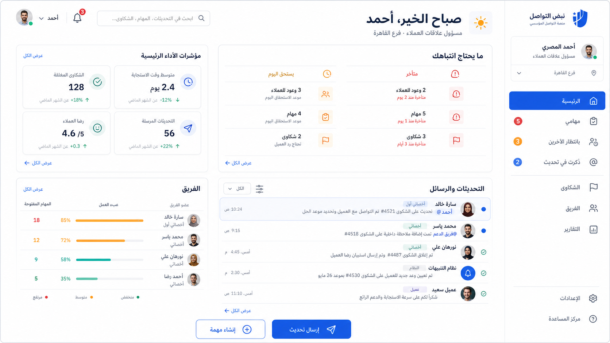

# CMS-Auto Modern Employee Experience

Status: **approved visual direction; implementation not started**

This document turns the approved dashboard concept into a product and design
handoff. It covers the staff application only. Backend workflow authority,
session-derived RBAC and branch scope, audit behavior, notification rules, and
customer-portal privacy remain unchanged.

## Concept

The image is a direction, not a pixel-perfect specification. Generated names,
counts, charts, and branding are illustrative. Production UI must use real,
server-scoped data and the existing Arabic and English dictionaries.

## Product outcome

The staff home should answer these questions in under five seconds:

1. Who am I signed in as, under which role and branch scope?
2. What needs my attention now?
3. What am I waiting for from other people?
4. Which updates mention or affect me?
5. What is the safest next action I can perform?

The redesign succeeds when employees stop treating the product as a collection
of complaint forms and start treating it as their daily operational workspace.

## Design principles

### Responsibility before reporting

The first screen prioritizes overdue work, work due today, customer promises,
mentions, and blocked handoffs. KPI summaries support decisions; they do not
replace the work queue.

### Scope must always be visible

The staff shell always shows employee name, active role, branch or authorized
scope, language, notifications, and account actions. It never lets the client
choose or infer authority.

### Communication should look like communication

Comments and updates use a readable activity stream with author, role, time,
visibility, audience, unread state, and linked record. Recipient mechanics stay
available but do not dominate the composer.

### Progressive disclosure

Common actions expose only their required inputs. Advanced audience selection,
linked-task creation, attachments, and workflow fields open when requested.

### Fewer, stronger surfaces

Use section rhythm and dividers before adding another card. Reserve elevation for
menus, dialogs, active composers, and content that must sit above the page.

### Arabic is the primary composition

Design RTL first, then verify LTR. Arabic body text receives comfortable line
height and at least 14px rendered size. References, phone numbers, VINs, dates,
and mixed-language names use explicit bidirectional isolation.

## Information architecture

### Primary navigation

- **Home** — attention queue, recent updates, compact role-specific indicators.
- **My work** — assigned tasks, due today, overdue, blocked, and completed.
- **Waiting on others** — tasks, promises, and handoffs owned by someone else.
- **Mentions and updates** — record-scoped activity affecting the current user.
- **Complaints** — complaint queue, creation, and detail.
- **Team** — manager-only workload and exception view.
- **Reports** — trends, reconciled operational metrics, and exports.

Administration, audit, communication-group management, help, and account actions
remain available but do not compete with daily work in the primary navigation.

### Mobile navigation

Use a persistent bottom bar for the four highest-frequency destinations plus
More. The page header remains compact and does not duplicate product identity.
Mobile views show summaries and drill-downs rather than stacking the full desktop
dashboard into one long column.

## Staff shell specification

### Desktop

- Right-side RTL navigation rail; left-side in LTR.
- Collapsible between approximately 256px and a compact icon rail.
- Product identity at the top; employee/scope card directly beneath it.
- Active destination uses filled brand treatment, not color alone.
- Global search supports complaint reference, task title, customer, and vehicle
  identifiers within server-authorized scope.
- Top bar contains page context, notifications, language, and account menu.

### Identity and scope card

Required fields:

- Employee display name.
- Role label.
- Branch or multi-branch scope summary.
- Presence/session indicator only if the value is real.
- Account menu with logout; no role-preview or client-controlled role switching.

## Home dashboard specification

### 1. Greeting and primary actions

Show a short localized greeting, role, and branch. Primary actions are capability
driven. Typical examples are Send update and Create task; unauthorized actions
are absent and remain protected by the API.

### 2. Needs attention

Two compact groups:

- Overdue: tasks, promises, complaints, and handoffs already late.
- Due today: work with a deadline today or an SLA warning.

Each row includes type icon, count, plain-language reason, urgency, and a link to
the correctly filtered queue. Counts and labels must never be decorative.

### 3. Updates and messages

One chronological record-scoped activity feed with filters for All, Unread,
Mentions, Following, and Customer-visible updates. Each entry displays:

- Author or system actor.
- Role or source.
- Relative and absolute timestamp accessibly.
- Update text or safe excerpt.
- Linked complaint, task, case, or deal.
- Visibility: internal or customer-visible.
- Audience summary when permitted.
- Read/unread state and expected next action when one exists.

This is not a standalone chat system. Every update remains attached to an
authorized business record.

### 4. Operational indicators

Use four maximum on the default employee home. Each indicator is clickable and
contains a value, unit, comparison period, trend, and destination. Managers may
see team-level indicators; employees see personal or scoped operational values.

Avoid ranking employees by raw completed-task counts. Prefer overdue work,
on-time completion, promise-kept rate, first response, and workload risk.

### 5. Team workload

Managers see a compact exception table, not a decorative chart. Show employee,
role, open workload, overdue count, and workload-risk indicator. Every row opens
the authorized filtered view.

## Conversation and composer specification

### Activity item

- Avatar or deterministic initials.
- Display name and role.
- Timestamp.
- Message content with mention highlighting.
- Internal/customer-visible badge.
- Linked-task or workflow event treatment when relevant.
- Audience summary behind a disclosure when it contains many recipients.

### Composer

The default state contains:

1. Visibility selector with plain language.
2. Update text.
3. Add recipients, attachment, or linked task actions.
4. Primary Send/Save action.

Recipient controls open progressively. Before submission, show one sentence such
as: “Internal update · mentions Sara once · Ahmed remains in CC.” The server still
resolves eligibility, deduplicates recipients, returns exact confirmation counts,
and rejects forbidden or oversized audiences.

Customer-visible updates keep their explicit warning and confirmation. Drafts
survive network, permission, and conflict errors wherever the existing API permits.

## Visual system

### Direction

- Warm neutral canvas rather than blue-gray everywhere.
- White primary surfaces and a deep navy text color.
- Restrained cobalt brand accent.
- Teal success, amber warning, and red only for actual danger or overdue state.
- Hairline dividers for structure; soft shadow only for elevated content.
- Medium radii: controls around 8px, panels around 12px.
- An 8px spacing grid with 4px allowed only for compact icon/text relationships.

### Token architecture

Retain the existing token entry points but organize their meaning into three
layers:

1. Primitive: neutral, blue, teal, amber, red, spacing, type, radius, shadow.
2. Semantic: canvas, surface, text, border, primary, success, warning, danger,
   focus, unread, overdue, selected.
3. Component: navigation, attention row, activity item, metric card, composer,
   filter bar, status badge.

No component should introduce raw colors. Existing off-token values should be
removed as touched rather than replaced in one risky mechanical rewrite.

### Typography

- Prefer a locally served Arabic-capable family such as Noto Sans Arabic, with a
  compatible Latin companion and system fallback.
- Page title: 28–32px desktop, 22–24px mobile.
- Section title: 18–20px.
- Body and control labels: 14–16px.
- Metadata: 12–13px only when contrast and line height remain sufficient.
- Use weight and spacing before increasing the number of colors.

### Density

- Standard control height: 40px; important mobile controls: 44–48px.
- Operational row: 48–56px depending on content.
- Panel padding: 16–24px.
- Tables remain tables on desktop. Mobile receives a purpose-built summary row,
  not a card conversion of every cell.

## Core component inventory

Reuse or extend shadcn/Radix primitives for:

- App navigation and account menu.
- Global search combobox.
- Attention group and attention row.
- Activity feed and activity item.
- Update composer and recipient disclosure.
- Interactive metric card.
- Filter chips and advanced filter drawer.
- Employee/scope identity card.
- Team workload table.
- Status, visibility, unread, and urgency badges.
- Loading skeletons, actionable empty states, errors with retry, success feedback,
  concurrency conflict recovery, and destructive confirmation.

Every interactive component covers default, hover, focus, active, disabled,
loading, error, and permission-constrained behavior. State is never conveyed by
color alone.

## Responsive behavior

### 1440px and 1280px

Use the full navigation rail and a two-column workspace. Attention and activity
receive more space than metrics. Avoid fixed heights that create empty canvases.

### 1024px

Collapse the navigation rail. Keep attention and activity above metrics. Reduce
secondary metadata before shrinking primary labels.

### 768px

Use a single main column with compact section summaries. Tables may scroll within
their own containers when a summary view would remove necessary operational data.

### 390px and 430px

Use bottom navigation, one primary action, collapsible secondary sections, short
attention rows, and dedicated mobile report summaries. Do not reproduce the full
desktop report as a sequence of cards.

## Accessibility and localization acceptance

- WCAG AA contrast for text, controls, status indicators, and focus rings.
- Visible 2px focus ring with offset on every interactive element.
- Logical layout properties and correct reading order in RTL and LTR.
- Minimum 44px touch target for primary mobile actions.
- Icon-only actions have localized accessible names.
- Loading, save, error, and conflict changes are announced.
- Mixed-direction values use `bdi` or equivalent isolation.
- Dates display localized formats; Arabic must not show `mm/dd/yyyy` as the user
  instruction.
- Arabic and English screenshots cover loading, empty, populated, error, conflict,
  confirmation, and long-content states.

## Implementation sequence

Each slice should remain independently reviewable and preserve current behavior.

### Slice 1 — Visual foundation and shell

Goal: make identity, role, branch scope, navigation, and hierarchy unmistakable.

- Refine semantic typography, spacing, surface, border, and elevation tokens.
- Restyle existing shadcn primitives through their shared variants.
- Recompose the staff shell, top bar, identity/scope card, desktop navigation, and
  mobile bottom navigation.
- Keep existing route and permission filtering.
- Produce Arabic and English shell screenshots at 390, 768, 1024, and 1440px.

### Slice 2 — Actionable employee home

Goal: replace the static dashboard with a role-specific work cockpit.

- Compose greeting, capability-driven actions, needs-attention groups, recent
  activity, and interactive operational indicators.
- Reuse current task, complaint, SLA, notification, and dashboard data first.
- If one combined read endpoint is necessary for latency, add only the smallest
  server-scoped aggregation contract.
- Every count links to a real filtered destination.

### Slice 3 — Communication presentation

Goal: make complaint and task updates feel like one understandable activity model.

- Introduce the shared activity item and feed presentation.
- Simplify the default composer and progressively disclose recipients and linked
  actions.
- Preserve server capabilities, watcher state, audience thresholds, exact
  confirmation counts, customer-public warnings, and draft-preserving errors.
- Apply the pattern to task conversations and complaint communication.

### Slice 4 — Work queues and filters

Goal: make repeated daily filtering fast.

- Add quick filters for Mine, Overdue, Due today, Unassigned, and SLA warning where
  authorized and supported by the API.
- Show active filter chips, result count, sorting, and clear-all.
- Keep advanced filters in a drawer or disclosure.
- Preserve pagination and server-side scope.

### Slice 5 — Reports and management surfaces

Goal: turn reports into decision tools rather than large collections of metrics.

- Group indicators by decision: SLA, promises, workload, aging, and recurrence.
- Add comparison context and drill-down.
- Give 390/430px a concise management summary and exception list.
- Keep exports server-scoped, audited, and reconciled with report filters.

### Slice 6 — Consistency and release gate

Goal: remove the remaining visual fragmentation.

- Apply the system to login, groups, notifications, admin hubs, and remaining
  operational pages without altering their authority model.
- Remove touched off-token styles.
- Run full Arabic and English visual, accessibility, localization, performance,
  and critical-workflow proof.
- Complete employee and manager usability sessions before declaring the redesign
  successful.

## Validation scorecard

The redesign is accepted only when:

- At least 80% of employee test participants identify role and branch scope in
  five seconds without prompting.
- At least 80% find their most urgent item and open it in ten seconds.
- At least 80% correctly explain assignee, one-time mention, persistent CC, and
  customer-visible update before sending.
- No tested role sees an action or record outside server-authorized scope.
- Arabic and English layouts pass the required responsive and accessibility gates.
- Dashboard and work queue meet deployed p95 performance targets.
- Visual review finds no raw IDs, technical enum labels, decorative dead metrics,
  mobile desktop-stacking, or page-level horizontal overflow.

## Explicitly excluded

- Standalone chat rooms.
- New workflow authority in React.
- Client-derived roles, branches, permissions, or recipient eligibility.
- AI assistants, sentiment, prediction, or automated message writing.
- Native mobile application.
- A full design-system rewrite before the employee home proves the direction.

